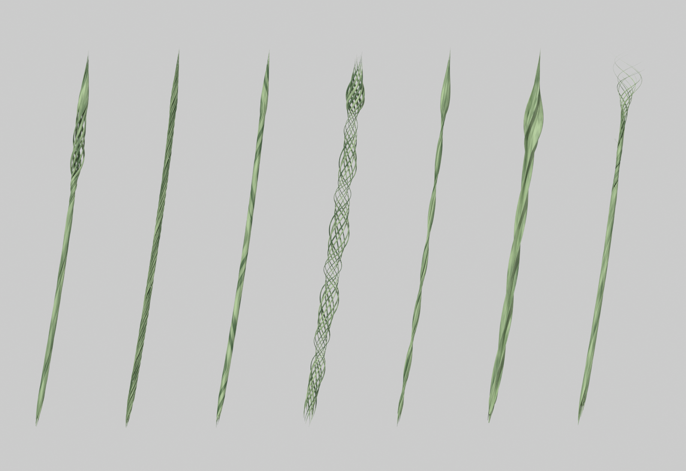
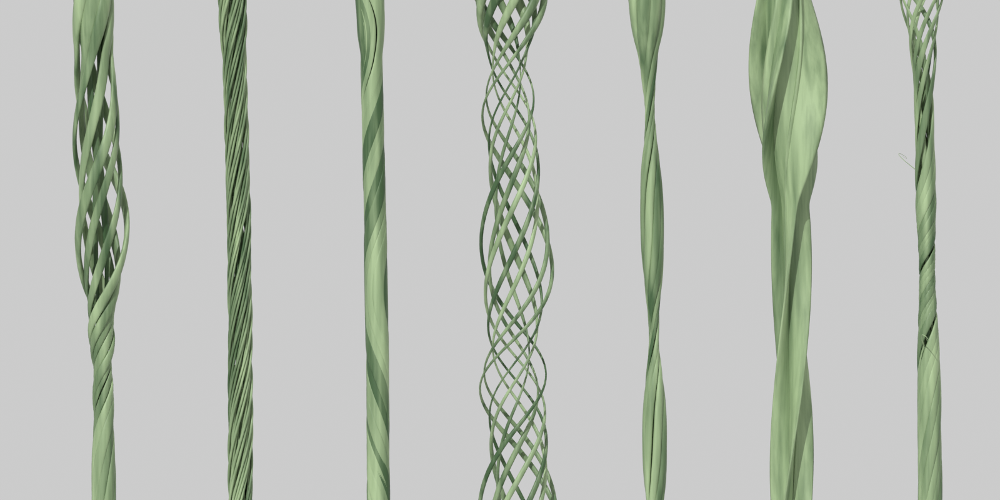

# Twisted Plant Spear (Blender アドオン)

茎や葉（ストランド）をねじり合わせた構造だけでできた槍を、パラメータで生成する Blender アドオンです。

上部のアップ：

左から `Twisted`（デフォルト）/ `Rope` / `Reversing` / `Cage` / `Knotted` / `Leaf Blades` / `Flame`

## インストール

1. Blender で **Edit > Preferences > Add-ons**
2. 右上の **▼ > Install from Disk...** で **`plant_spear.zip`** を選択
3. 一覧の「Twisted Plant Spear」にチェックを入れて有効化

Blender 3.6 / 4.x / 5.0 向け（5.0.1 で zip からのインストールを確認済み）。

## 使い方

- 3D ビューで **N** キー → **Plant Spear** タブ → **Add Twisted Spear** からプリセットを選ぶ
  （**Add > Mesh > Twisted Spear** からも追加できます）
- 槍を選択したままスライダーを動かすと、その場で再生成されます
- **Seed** 横のボタンで別個体、**Duplicate as Variant** で別シードの複製を横に並べて比較
- 重いときは **Live Update** をオフにして **Regenerate**、または **Detail** を下げる
- 決まったら **Convert to Plain Mesh** で通常メッシュに

## パラメータ

| パネル | 内容 |
|---|---|
| Silhouette（全体の形） | 束の太さ・テーパー、上端/下端のすぼまり（長さ・鋭さ）、穂先の葉形ふくらみ（量・位置・長さ・形）、反り、うねり |
| Strands（ストランド） | 本数、**層の数**（同心円状に内側の層を重ねる）、層間隔、内層の太さ、詰まり具合、**断面の平たさ（丸い茎↔平たい葉）**、断面自体のねじれ、太さのばらつき・ムラ、端のギザギザ |
| Twist（ねじり） | ねじり回数（マイナスで逆回り）、上下でのきつさの勾配、**内層の撚り倍率（マイナスで逆撚り＝ロープ構造）**、**ねじり方向の反転回数（S/Z撚り）**、ねじりの乱れ、ゆるみ |
| Knots（締まり） | 締まる箇所の数・範囲・幅、そこでのねじりの増加量とくびれ量 |
| Splay / Flare（ほどけ・開き） | 途中で籠状に広がる量・位置・範囲、穂先/下端でストランドが外へ開く量 |
| Ply（撚り糸） | 各ストランドをさらに細い撚り糸の撚り合わせにする（本数・撚りの強さ・太さ） |
| Fray（抜け出し） | ストランドが途中で束から抜け出し、くるっと巻く（確率・範囲・長さ・巻き数） |
| Color（色） | 暗色・明色、ストランドごとの色のばらつき |

メッシュには面ごとに `strand_random` 属性（ストランドごとの乱数 0〜1）が入っているので、自作マテリアルでも Attribute ノードでストランドごとに色を変えられます。
