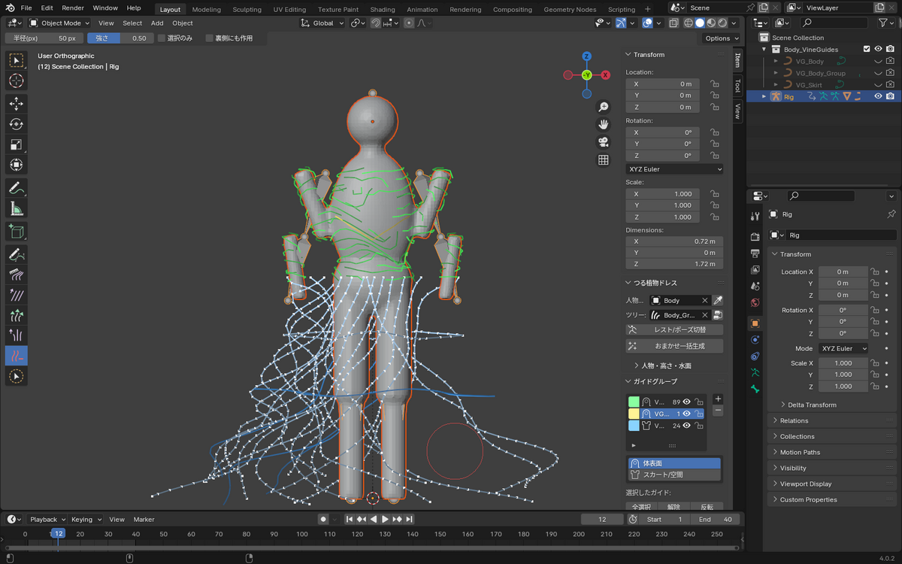
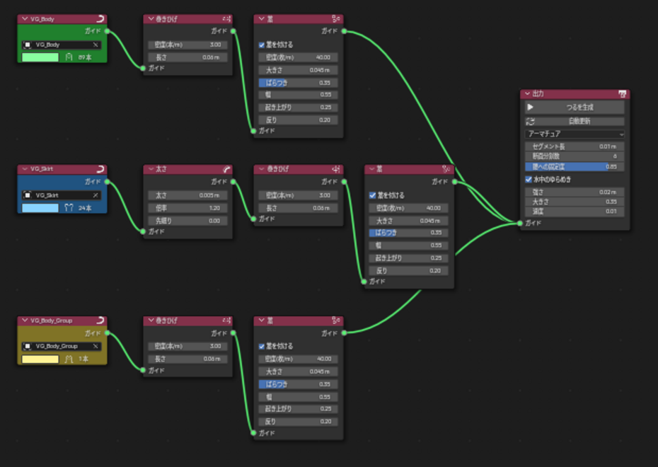
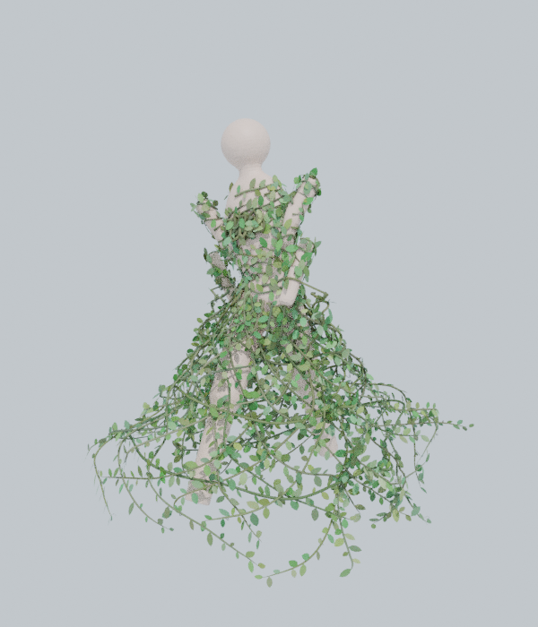

# Vine Dress — つる植物ドレス生成アドオン (Blender)

> **新しい版:** ガイドカーブを直接編集し、ペイントから自動生成する汎用版 [Vine Wrap](../vine_wrap/README.md) があります。

人物にガイドカーブを **グルーミング** し、**ノードグラフ** でつる植物の服を作る Blender アドオンです（Maya の Yeti のような流れで使えます）。
腰から下の水につかっている部分はスカートのように広がり、つるは人物のアニメーションに追従します。



| ノードグラフ（Vine Groom） | 生成結果 |
|---|---|
|  |  |

## 対応バージョン
- Blender 3.6 〜 4.x（4.0 で実際の画面を操作して、4.2 LTS ではスクリプトから動作確認済み）

## インストール
1. `vine_dress.zip` を使う（`vine_dress/` フォルダを zip にしても可）
2. `編集 > プリファレンス > アドオン` からインストールして有効化（4.2 以降は `エクステンション` 右上の ▼ → `ディスクからインストール`）
3. 3Dビューポートで `N` → **Vine Dress** タブ

## 全体の流れ
```
 ガイドグループ（カーブ）  ──▶  Vine Groom ノードグラフ  ──▶  つるメッシュ
  ・自動生成 / 手描き            ・グループごとに見た目を調整      ・アニメーションに追従
  ・グルームツールで編集          ・散布 / 絡み / ノイズ / 葉 …     ・水中のゆらめき
```
1. 人物メッシュを設定（スポイトボタン）
2. **ガイド自動生成** で下地を作る（または **ガイド描画** ツールで描く）
3. **グルームツール** でガイドを整え、**グループ** に分ける
4. **ノードエディタ（Vine Groom）** でグループごとの見た目を調整
5. **つるを生成**（「自動更新」をオンにすると、変更のたびに作り直されます）

## ガイドグループ
サイドバーの **ガイドグループ** リストでグループを管理します。
- `＋` で追加（体表面 / スカート・空間）、`－` で削除。名前はダブルクリックで変更
- 色・表示（目のアイコン）・ロック（鍵のアイコン：ブラシで編集できなくなる）をグループごとに設定
- リストで選んだグループが **アクティブグループ**。新しく描いたガイドはここに入る
- 種類
  - **体表面**: 体に吸着する（服の部分）
  - **スカート/空間**: 空間に浮かぶ（水中スカート、漂うつる）。体の中には入らない
- **選択したガイド**: 全選択 / 解除 / 反転、**アクティブへ移動**、**新グループへ**（選択からグループを作る）、**体に吸着**、**削除**

ガイドの実体は各グループのカーブオブジェクト（`<人物名>_VineGuides` コレクション）です。普段は非表示で、ビューポートにはアドオン専用の表示で描かれます。

## グルームツール（オブジェクトモードのまま使える）
ツールバー（左端）またはサイドバーのボタンから選びます。編集モードに切り替える必要はありません。

| ツール | 操作 |
|---|---|
| **ガイド描画** | 体の上をドラッグして、アクティブグループにガイドを描く。スカート/空間グループでは、描き始めた位置の奥行きの平面に描く |
| **コーム** | なでて流れを整える（根元は固定。「長さを維持」でガイドの長さを保つ） |
| **スムーズ** | ガタつきをならす |
| **伸ばす/縮める** | 先端を伸ばす（`Ctrl` で縮める） |
| **太さ** | つるを太くする（`Ctrl` で細くする） |
| **消去** | 触れたガイドを削除 |
| **ガイド選択** | ブラシで選択（`Shift` で追加、`Ctrl` で解除） |

- 共通: `Shift`+ドラッグでスムーズ、`[` `]` でブラシ半径、`右クリック`/`Esc` でストロークを取り消し、`Ctrl+Z` で元に戻す
- **選択のみ**: 選択中のガイドにだけ作用する（グループ内の一部だけ整えたいとき）
- **裏側にも作用**: オフなら体の陰に隠れたガイドは触らない
- ツールを使うと、人物は自動でレストポーズになります（ガイドはレストポーズを基準にしているため）。**レスト/ポーズ切替** でアニメーション表示に戻せます
- 表示設定（グルームツール > 表示）: ガイドを表示、透過表示、ポーズ中も表示、線の太さ
- 選択中のガイドは明るい色と点で表示されます。色は根元が明るく、先端に向かって暗くなる（伸びる方向が分かる）

## ノードグラフ（Vine Groom）
**ノードエディタで開く**（サイドバーのツリー欄のボタン）で表示します。新しいノードは `Shift+A` → **Vine Groom** から追加します。
ガイドグループのノードから出力ノードまで、ガイドの流れに沿って見た目の属性を付けていきます。枝分かれさせると、グループごと・流れごとに違う見た目にできます。

| ノード | 内容 |
|---|---|
| **ガイドグループ** | グループをグラフに入れる（グループの色で表示） |
| **散布** | 各ガイドの周りに子ガイドを増やす（数・半径・長さのばらつき・ゆらぎ）。少ないガイドから密なつるを作れる |
| **絡み** | 1本のガイドに複数のつるを絡ませる（本数・幅・回転数・太さ比） |
| **ノイズ** | つるをうねらせる（体表面では肌にめり込まない） |
| **体への吸着** | 体表面ガイドを肌に吸着させるか、肌からの距離 |
| **太さ** | 基本の太さ・倍率・先細り（ガイドの点ごとの太さにさらに掛かる） |
| **巻きひげ** | 螺旋状の巻きひげ（密度・長さ） |
| **葉** | 葉の有無・密度・大きさ・幅・起き上がり・反り |
| **色** | 茎と葉の色、ばらつき |
| **マージ** | 複数の流れをまとめる |
| **出力** | 生成ボタン・自動更新・追従方法・セグメント長・断面分割数・腰への固定度・水中のゆらめき |

- ノードをミュート（`M`）すると、そのノードを素通りします
- グループを追加すると、ツリーにも自動で「ガイドグループ → 巻きひげ → 葉 → 出力」の流れが追加されます。足りなければ **未接続グループを追加** を押します

## アニメーション追従
- **アーマチュア（推奨）**: 人物のボーンウェイトをつるに写し、同じアーマチュアで変形します。スカートは下へ行くほど腰のウェイトに寄せてあるので、歩いても裾が裂けません（出力ノードの「腰への固定度」で調整）
- **サーフェス変形**: シェイプキーや Alembic で動く人物向け
- **水中のゆらめき**: 水面より下はノイズで揺れます（裾ほど強く揺れる）

## ガイド自動生成
**ガイド自動生成** パネルで、グループ `VG_Body`（上半身・体表面）と `VG_Skirt`（スカート）を作り直します。
同じグループを作り直すのでノードの接続はそのまま残り、自分で作った他のグループには影響しません。
上半身は、体に巻き付きながら隙間を埋めていく成長シミュレーション、スカートはベル形の編み込みで作ります。
水面の高さやスカートの範囲は **人物・高さ・水面** パネルで設定します。

## ファイル構成
```
vine_dress/
  guides.py      ガイドグループ（カーブの読み書き、グループ設定）
  tools.py       グルームツール（ブラシ処理・モーダル操作・ツールバー登録）
  overlay.py     ビューポート表示（ガイド・ブラシ円・描画中の線）
  groom_tree.py  Vine Groom ノードツリー（ノード定義・評価・自動更新）
  build.py       ガイド → つるの中心線（散布・絡み・ノイズ・巻きひげ）
  pipeline.py    自動ガイド生成・つる生成の処理
  growth.py / skirt.py  自動生成（上半身の成長 / スカート形状とウェイト）
  sampler.py     体表面の検索、法線・ウェイトの補間
  meshgen.py     チューブ・葉のメッシュ
  binding.py     アーマチュア/サーフェス変形、ゆらめき、マテリアル
  operators.py / ui.py / properties.py
```
