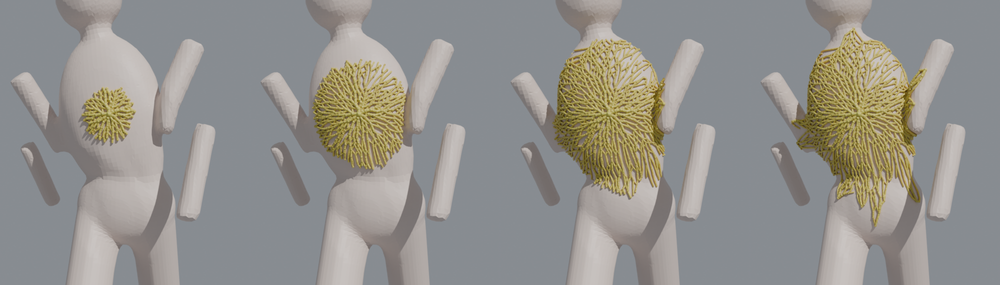
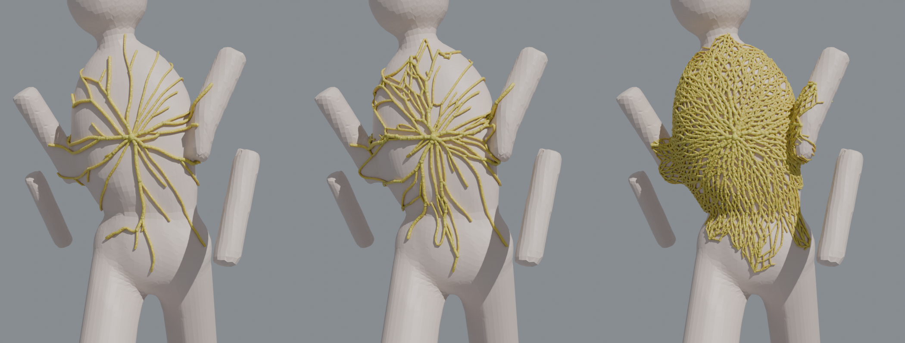
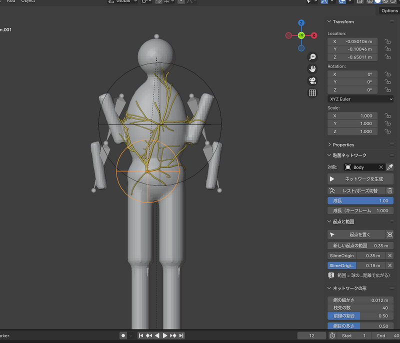

# Slime Net — 粘菌ネットワーク生成アドオン (Blender)

3Dオブジェクトの一点（起点）を指定すると、そこから **オブジェクトの表面に沿って** 粘菌（モジホコリ）のようなネットワークが広がります。
広がる範囲は起点ごとに調整でき、成長の様子をアニメーションにできます。対象がアーマチュアで動いても追従します。

「網目の多さ」0 / 0.5 / 0.9 の違い:

## 対応バージョン
- Blender 3.6 以降（4.0 で実際の画面を操作して、4.2 LTS ではスクリプトから動作確認済み。5.x は未確認）
- numpy を使います（公式版の Blender には同梱されています）

## インストール
1. `slime_net.zip` を `編集 > プリファレンス > アドオン`（4.2 以降は `エクステンション` → `ディスクからインストール`）でインストール
2. 3Dビューポートで `N` → **Slime Net** タブ

## 使い方
1. ネットワークを広げるメッシュを選び、スポイトボタンで **対象** に設定
2. **起点を置く** → 対象の上をクリック（続けてクリックで複数。`Enter` / 右クリック / `Esc` で終了。`Alt`+ドラッグ・中ボタンで視点操作できる）
3. 起点の **範囲** をパネルの数値で調整（起点は球の Empty で、球の大きさ＝範囲。普通のオブジェクトとして `G` で動かせる）
4. **ネットワークを生成**（結果やうまくいかなかった理由はパネルに表示されます）
5. **成長** で広がり具合を変える。アニメーションにするときは、その下の「成長（キーフレーム用）」にマウスを乗せて `I` でキーフレームを打つ

## 仕組み
1. 起点の範囲内の表面に点を散らし、近くの点どうしを **表面に沿って** つなぐ（腕と胴の隙間のように、空中を渡るつなぎ方はしない）
2. 起点からの **表面に沿った距離**（測地線距離）が範囲を超える所は使わない
3. 粘菌の数理モデル（Tero ら。粘菌で東京の鉄道網を再現した研究のモデル）で、起点と「餌」の間に流れを流す。流れの多い管は太くなり、使われない管は消える → 太い幹、細い毛細管、ループが自然にできる
4. 残った管を、表面に沿ったなめらかなチューブにする。分岐点は丸くつなぐ

## 設定
| 項目 | 内容 |
|---|---|
| 網の細かさ | もとになる点の間隔。小さいほど細かい網（重くなる） |
| 枝先の数 | 管が向かう「餌」の数。多いほど枝分かれが増える |
| 前線の割合 | 餌のうち範囲の外周近くに置く割合。高いと、扇状に広がる前線ができる |
| 網目の多さ | 0: 木のような枝分かれ → 1: ループの多い網目状 |
| 細い管を残す | どこまで細い管を残すか |
| 起点からの流れ | 高いほど、起点から放射状に太い幹が出る |
| 計算回数 / シード | 計算の回数と乱数のシード（シードを変えると別のパターン） |
| 最小・最大の太さ | 管の太さの範囲（流れの量で決まる） |
| 色 | 細い管と太い管の色、粗さ、透け感（SSS）。生成物には `slime_thick`（0=細い〜1=太い）と `slime_dist`（0=起点〜1=範囲の端）の属性があり、マテリアルで使える |
| 追従方法 | アーマチュア（ボーンウェイトを転写）/ サーフェス変形 / なし。生成はレストポーズで行う |

長さの値は「サイズ自動スケール」がオンのとき、最大寸法 1.7m の物体を基準に、対象の大きさに合わせて拡大縮小されます。
