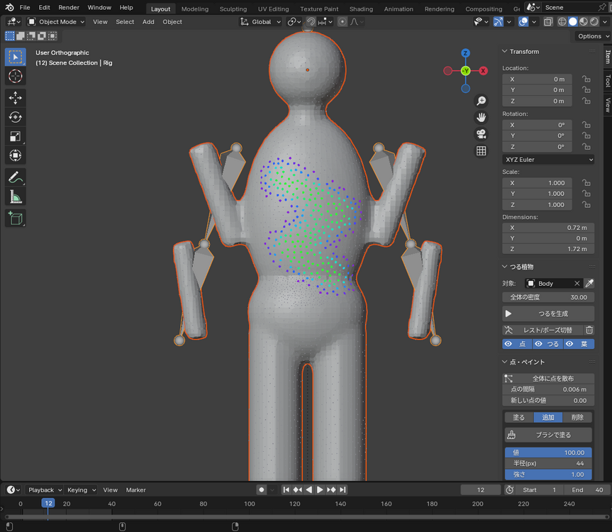
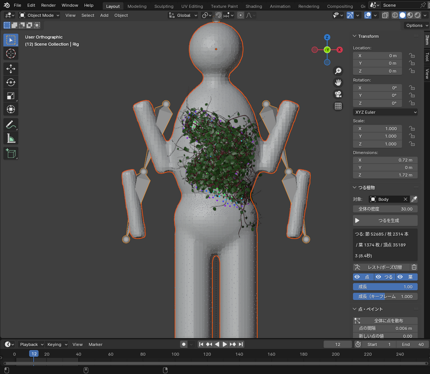
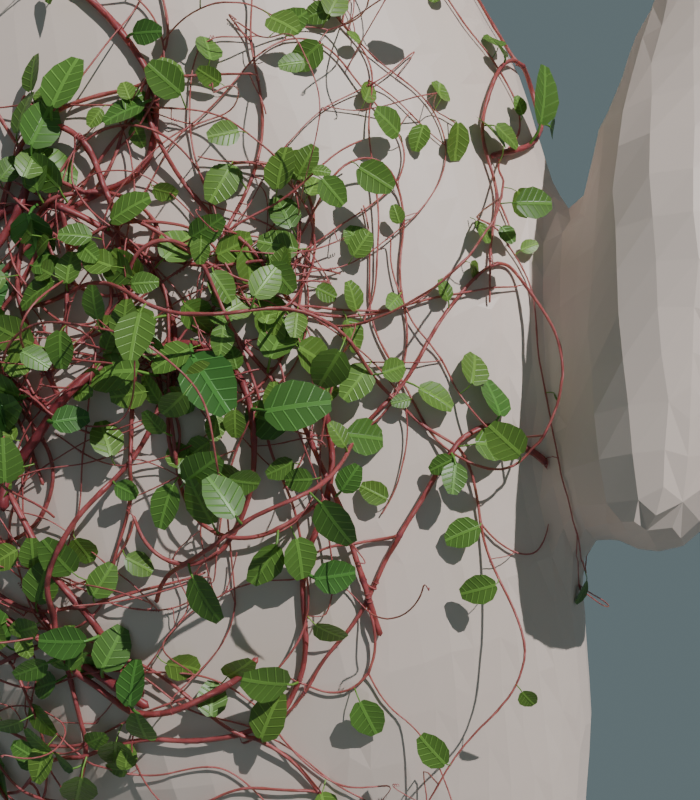

# Vine Grow — つる植物ジェネレータ (Blender)

体の表面に点を打ち、Yeti のようにブラシで **密度をペイント** すると、塗った所ほど密に **つる植物（茎と葉）** が茂ります。
つるは方向なく絡まり合い、体に沿いながら少し空間にも浮き上がります。体を貫通せず、対象のアニメーションに追従し、伸びていく様子もアニメーションにできます。

点に密度を塗る（紫=0 → 青 → 水色 → 緑=100）と、生成結果:

 

つる（左: 正面、中: 近く、右: 横から。茎が体から浮いて重なる）:

葉（ハート形の葉身・葉柄・葉脈。体の外を向き、先の方ほど小さく若い色）:

## 対応バージョン
- Blender 3.6 以降（4.0 で実際の画面を操作して、4.2 LTS ではスクリプトから動作確認済み。5.x は未確認）

## インストール
1. `vine_grow.zip` を `編集 > プリファレンス > アドオン`（4.2 以降は `エクステンション` → `ディスクからインストール`）でインストール
2. 3Dビューポートで `N` → **Vine Grow** タブ

## 使い方
1. つるを生やすメッシュを選び、スポイトボタンで **対象** に設定
2. **全体に点を散布**：「点の間隔」ごとに体全体へ点を打つ（打ち直しても、塗った値は近くの新しい点に引き継がれる）
3. **ブラシで塗る** → 対象の上を左ドラッグ。ブラシは「塗る / 追加 / 削除」（ブラシ中は `1` `2` `3` キーでも切替）
   - 塗る：点の値を「値」（0〜100）に近づける（「強さ」で効き具合）。`Ctrl`+ドラッグで減らす、`Shift`+ドラッグでぼかす
   - 追加：ブラシの中に点を足す（`Ctrl` で削除）／削除：ブラシの中の点を消す
   - **`B` を押したままマウスを上下** でブラシの大きさを変える（上で大きく、下で小さく）
   - `Alt`+ドラッグ・中ボタンで視点操作、`Enter` / 右クリック / `Esc` で終了（ブラシ1回分が1つの元に戻す単位）
4. 点は値に応じた色で表示される（**紫=0 → 青 → 水色 → 緑=100**。値 0 の点は小さな灰色）
5. **全体の密度**：値 100 で塗った所の密度（100cm² あたりのつるの本数）。塗った値はこれに対する割合なので、ここで全体の量を調整する
6. **つるを生成**（結果やうまくいかなかった理由はパネルに表示されます）
7. **点 / つる / 葉** ボタンで、それぞれ表示・非表示（塗るときはつると葉を隠すと見やすい。葉は `<対象>_Leaves`、点は `<対象>_VinePoints` という別オブジェクト）
8. **成長** で伸び具合を変える（葉も一緒に出てくる）。アニメーションにするときは「成長（キーフレーム用）」にマウスを乗せて `I` でキーフレームを打つ

## 仕組み
1. 塗った値（0〜100）×「全体の密度」/100 を、「なじませる距離」で隣の点となめらかにつなぐ（体の裏表は混ぜない）。「粗密の強さ」で密な所と疎な所の差を強調する。つるの伸びる先は制限しない
2. 密度の高い所ほど多く、つるの根元をランダムに置く。向きもランダムなので、流れの方向はない
3. 1本のつるは根元が太く先が細い1本の茎で、なめらかに曲がりくねりながら体を這う。疎な方へ向かうと少しだけ密な方へ曲がる（「密な所に留まる強さ」、0 で完全に自由）
4. 茎は所々で体から **浮き上がってアーチ状に戻り**、他の茎に出会うとその **上を乗り越える** ので、絡まりに奥行きができる
5. 一定間隔の **節**（少しふくらむ）から脇枝と巻きひげが出る。巻きひげは近くに茎があれば **その茎に巻き付き**、なければ自分で巻く
6. 一部の先端は体を離れて **空中へ伸び**、先は巻く。成長アニメーションでは、すべてのつるが根元から一斉に伸びる
7. 生成はレストポーズで行い、ボーンウェイトを転写してアーマチュアで追従させる

## 葉
- 茎に沿って「葉の間隔」ごとに、左右交互に葉を付ける（巻きひげには付けない）
- 葉身は卵形とハート形（カーディオイド）の中間で、「付け根の切れ込み」で形を変える。葉柄で茎から少し離し、表を体の外側に向け、左右に丸まり・中央で折れ・先が垂れる
- 細い茎（先の方）の葉ほど小さく、若い葉の色になる。マテリアルには葉脈（中央脈と側脈）と少しの透け感がある
- 葉の頂点も体の外に押し出すので貫通しない。つると同じ方法でアニメーションに追従する

## 設定
| 項目 | 内容 |
|---|---|
| 全体の密度 | 値 100 の所の密度（100cm² あたりのつるの本数） |
| 点の間隔 / 新しい点の値 | 散布・追加する点の間隔と、その最初の値（0〜100） |
| ブラシ | 塗る / 追加 / 削除、値（0〜100）、半径（画面上のピクセル。`B`+上下でも変更）、強さ、追加した点をブラシの値で塗る |
| 点の表示サイズ / なじませる距離 | 点の表示の大きさと、隣り合う点の値をなめらかにつなぐ距離 |
| 粗密の強さ / 密な所に留まる強さ | 密な所と疎な所の差の強調 / 疎な方へ伸びるつるを密な方へ戻す強さ |
| つるの長さ / うねり / うねりの大きさ | 1本のつるの長さと、曲がりくねり方（うねりの大きさが小さいほど細かく曲がる） |
| 節の間隔 / 枝分かれ / 巻きひげの割合 | 節（脇枝・巻きひげが出る所）の間隔と、節ごとに脇枝・巻きひげが出る割合 |
| 空間への広がり / 密着度 / 空中へ伸びる先端 / 上へ伸びる強さ | 茎が体から浮き上がる高さ、浮く茎の少なさ（1でほぼ密着）、空中へ伸びる先端の割合と向き |
| 体との最小距離 / 細かさ / 最大の節数 / シード | 貫通防止の距離、茎の点の間隔、重さの上限、乱数 |
| 最小・最大の太さ / 断面分割数 | 茎の太さ（初期値は 0.4〜2mm）と断面の分割 |
| 色・質感 | 細い茎と太い茎の色、粗さ、透け感、表面の凹凸。生成物には `vine_thick`（0=細い〜1=太い）、`vine_dist`（成長の順）、`vine_color` の属性があり、マテリアルで使える |
| 葉 | 葉の付き方 / 間隔 / 大きさ・ばらつき・先端ほど小さく / 幅・付け根の切れ込み・先のとがり・葉柄の長さ / 丸まり・中央の折れ・垂れ・外を向く強さ / 色・若い葉の色 / 透け感・粗さ |
| 追従方法 | アーマチュア（ボーンウェイトを転写）/ サーフェス変形 / なし |

長さの値は「サイズ自動スケール」がオンのとき、最大寸法 1.7m の物体を基準に、対象の大きさに合わせて拡大縮小されます。
