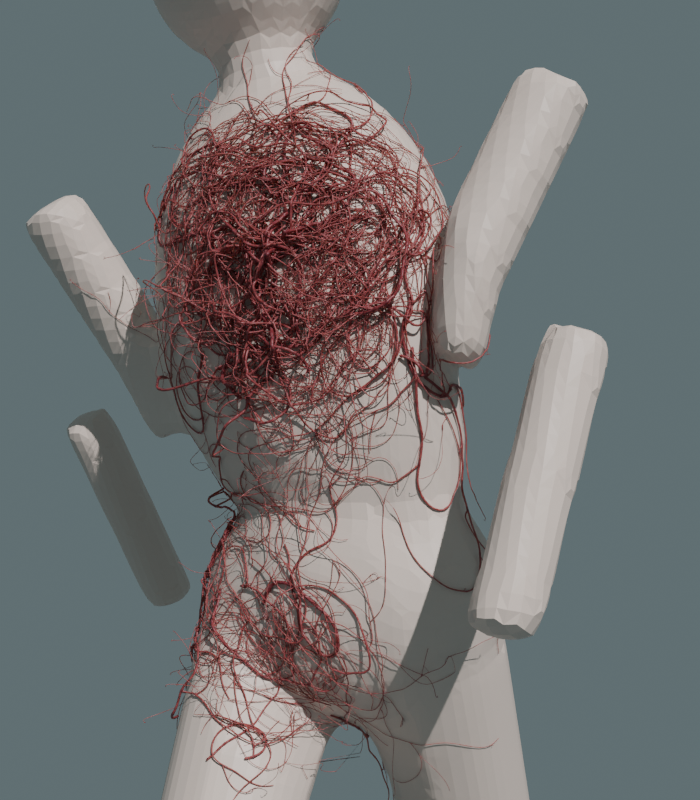
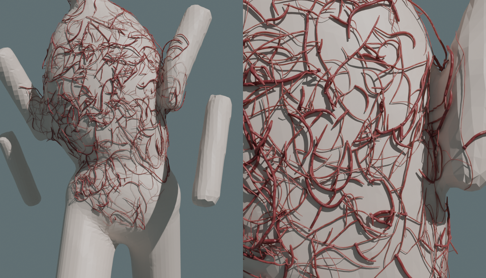
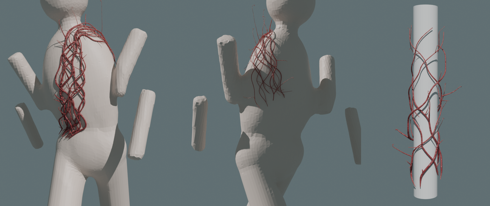
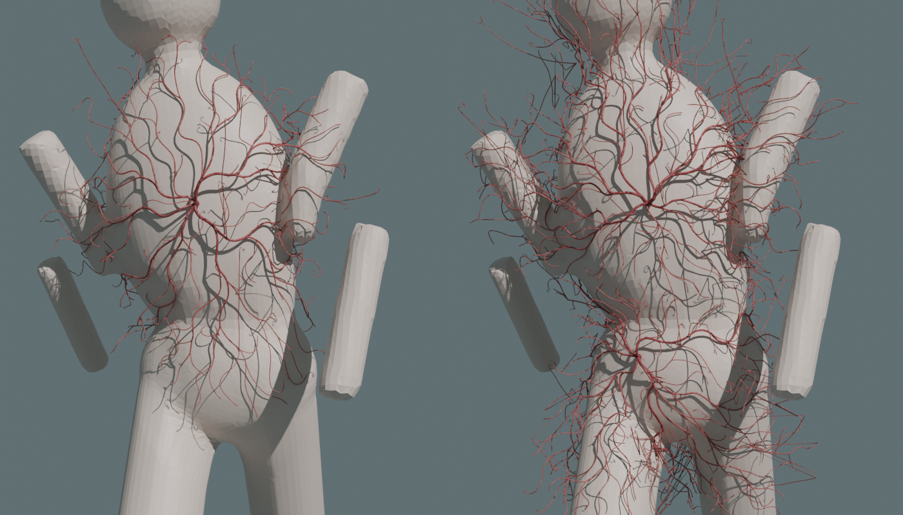
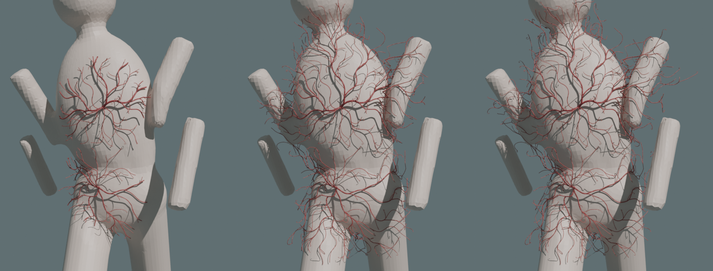
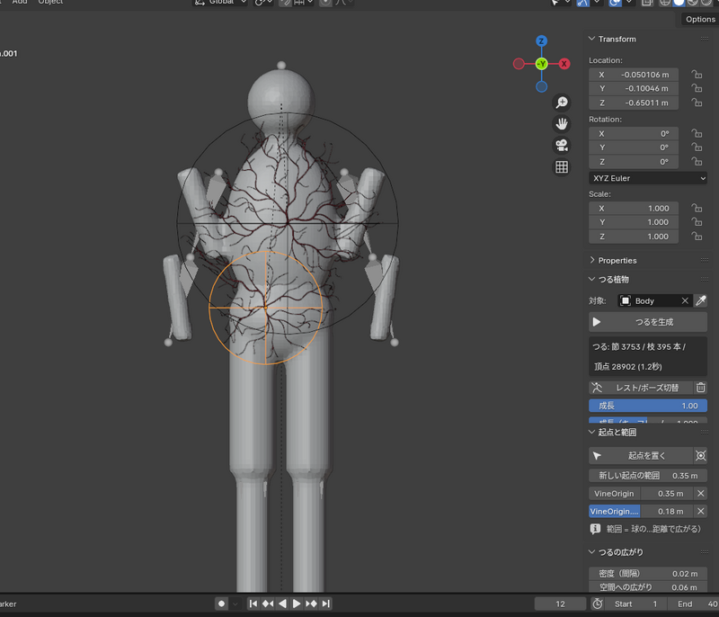

# Vine Grow — つる植物ジェネレータ (Blender)

3Dオブジェクトの上に点を置くと、そこを手がかりに **体に絡みつきながら、少し空間にも広がる** つる植物の枝ができます。
葉や花はなく、枝（茎）だけを作ります。体を貫通せず、対象のアニメーションに追従し、伸びていく様子をアニメーションにもできます。

生え方は3種類あります。

- **密度（初期設定）**: 置いた点の周りほど密に、細いつる植物が方向なく絡まり合って茂る。茎は体から浮いたり戻ったりして立体的に重なり、一部の先端は空中へ伸び、巻きひげは隣の茎に巻き付く
- **経路**: 置いた点を **通過点** として、1番目 → 2番目 → … の順に体の表面をたどって、数本のつるが絡み合いながら伸びる。腕や首など細い所ではぐるりと巻き付き、胴体など広い所では束が編み込むように蛇行する
- **放射**: 置いた点から周りに枝分かれしながら広がる

点ごとの密度（胸 40 / みぞおち 3 / 腰 15 / 肩 1）:

密度モード（左: 胸・肩・腰に点を置いた例、中: 近くで見たところ、右: 横から見たところ。茎が体から浮いて重なっている）:

経路モード（左: 腰 → 胸 → 首 → 肩 → 背中の経路、中: 背中側、右: 細い棒に巻き付く様子）:

放射モード:

成長 0.3 → 0.6 → 1.0（放射モード）:

## 対応バージョン
- Blender 3.6 以降（4.0 で実際の画面を操作して、4.2 LTS ではスクリプトから動作確認済み。5.x は未確認）

## インストール
1. `vine_grow.zip` を `編集 > プリファレンス > アドオン`（4.2 以降は `エクステンション` → `ディスクからインストール`）でインストール
2. 3Dビューポートで `N` → **Vine Grow** タブ

## 使い方
1. つるを生やすメッシュを選び、スポイトボタンで **対象** に設定
2. **生え方** を選ぶ（密度 / 経路 / 放射）
3. **起点を置く**（経路モードでは **経由点を置く**）→ 対象の上をクリック。経路モードではつるが通ってほしい順にクリックしていく（`Enter` / 右クリック / `Esc` で終了。`Alt`+ドラッグ・中ボタンで視点操作できる）。経路モードでは点が2つ以上必要
4. パネルの一覧で点ごとの **密度**（密度モード: その点の上での 100cm² あたりのつるの本数。0 で生えない）/ **範囲**（放射モード: 広がる距離）/ **幅**（経路モード: つるの束の太さ）を調整。経路モードでは順番は一覧の ↑↓ ボタンで入れ替えられる（点は球の Empty で、球の大きさ＝密度・幅・範囲）
5. **つるを生成**（結果やうまくいかなかった理由はパネルに表示されます）
6. **成長** で伸び具合を変える。アニメーションにするときは「成長（キーフレーム用）」にマウスを乗せて `I` でキーフレームを打つ

## 仕組み（密度モード）
1. 点ごとの **密度** を、体に沿った距離でなめらかに薄れさせて足し合わせる（「密度の広がり」がその距離。範囲の制限はなく、つるはどこへでも伸びる）。「粗密の強さ」で密な所と疎な所の差を強調する
2. 密度の高い所ほど多く、つるの根元をランダムに置く。向きもランダムなので、流れの方向はない
3. 1本のつるは根元が太く先が細い1本の茎で、なめらかに曲がりくねりながら体を這う。疎な方へ向かうと、少しだけ密な方へ曲がる（「密な所に留まる強さ」、0 で完全に自由）
4. 茎は所々で体から **浮き上がってアーチ状に戻り**、他の茎に出会うとその **上を乗り越える** ので、絡まりに奥行きができる
5. 一定間隔の **節**（少しふくらむ）から脇枝と巻きひげが出る。巻きひげは近くに茎があれば **その茎に巻き付き**、なければ自分で巻く
6. 一部の先端は体を離れて **空中へ伸び**、先は巻く。成長アニメーションは起点の中心から外へ広がる

## 仕組み（経路モード）
1. 経由点どうしを、体の表面に沿った最短経路（ダイクストラ法）でつなぐ。胸から背中へは体を突き抜けず肩を越えて回る
2. 経路に沿って数本のつるを、ロープのようにねじりながら伸ばす。体の部分の太さを測り、その中心の周りに回すので、腕や首では本当に巻き付き、胴体では束の幅の中で左右に編み込むように蛇行する
3. 半分のつるは逆向きに巻いて交差させ、一部は体から少し浮かせる。経由点の幅に合わせて束が太く・細くなる
4. つるから短い脇芽・空中に伸びる枝・巻きひげを出す。成長アニメーションは1番目の経由点から経路に沿って伸びていく

## 仕組み（放射モード）
1. 起点の範囲内（体に沿った距離）の表面の上に、**つるが向かう目標点** を散らす。目標点は体の表面から少し浮いた空間に置き、ほとんどは体の近く、一部は空間の離れた所に置く
2. 起点から目標点に向かって、枝が少しずつ伸びて枝分かれする（スペースコロニゼーション法。植物の枝や根の生成に使われる方法）
3. 伸びるたびに体の外へ押し出すので、体を貫通せず、体に巻き付くように回り込む
4. 枝は左右にくねりながら伸び、短い脇枝は整理して、先端はくるくる巻いた **巻きひげ** になる
5. **空中に伸びる枝** を体から離れる方向に追加し、先端は巻く
6. 太さは植物の枝と同じ規則（パイプモデル：枝分かれした細枝の太さを合わせると元の枝になる）で、根元が太く先が細い

## 設定
| 項目 | 内容 |
|---|---|
| 生え方 | 密度（点の周りに茂る）/ 経路（点を順に通過）/ 放射（点から広がる） |
| 点ごとの密度（密度） | 一覧で点ごとに設定。その点の上での 100cm² あたりのつるの本数（0 で生えない）。「新しい点の密度」は新しく置く点の初期値 |
| 密度の広がり（密度） | 各点の密度が体に沿って薄れていく距離（制限ではない） |
| 粗密の強さ（密度） | 1: そのまま / 大きいほど、密な所はより密に、疎な所はより疎に |
| 密な所に留まる強さ（密度） | 疎な方へ伸びるつるを密な方へ曲げ戻す強さ。0 で自由に伸びる |
| つるの長さ / うねり / うねりの大きさ（密度） | 1本のつるの長さと、曲がりくねり方（うねりの大きさが小さいほど細かく曲がる） |
| 節の間隔 / 枝分かれ / 巻きひげの割合（密度） | 節（脇枝・巻きひげが出る所）の間隔と、節ごとに脇枝・巻きひげが出る割合 |
| 空間への広がり / 密着度 / 空中へ伸びる先端（密度） | 茎が体から浮き上がる高さ、浮く茎の少なさ（1でほぼ密着）、空中へ伸びる先端の割合 |
| 細かさ / 最小・最大の太さ（密度） | 茎の点の間隔と太さ（初期値は 0.4〜2mm） |
| つるの本数（経路） | 経路に沿って伸びるつるの本数 |
| ねじれ（経路） | つるが経路の周りを巻く回数（1mあたり） |
| 巻き付く細さ（経路） | 束の幅が体の部分の半径に対してこの倍率以上の所（腕・首など）で、ぐるりと巻き付く。小さいほど太い所でも巻き付く |
| 逆巻きを混ぜる（経路） | 半分のつるを逆向きに巻いて編み込んだように交差させる |
| 始まりと終わりの揃い（経路） | 1: 全部のつるが最初と最後の点で揃う / 0: ばらばらに始まって終わる |
| 脇芽 / 脇芽の長さ（経路） | つるから出る短い脇芽の数（1mあたり）と長さ |
| 密度（間隔） | （放射）目標点の間隔。小さいほど密に茂る（重くなる） |
| 空間への広がり | 体の表面からどれだけ離れた空間まで、つるが広がるか |
| 密着度 | 0: 空間に均一に広がる / 1: ほとんど体に沿う |
| 体との最小距離 | 貫通防止のため、つるの中心線と体の間に空ける距離 |
| 引き寄せ距離 | 遠くの目標点にも引き寄せられるか。大きいほど長く伸びて枝分かれが少ない |
| 直進性 / くねり / くねりの周期 / 揺らぎ | 枝の曲がり方 |
| 短い小枝を整理 | これより短い脇枝は取り除く（枝先は巻きひげになる） |
| 空中に伸びる枝 / 長さ / 上へ伸びる強さ | 体から離れて空中に伸びる枝（負の値で垂れ下がる） |
| 巻きひげの割合 / 長さ | 枝先の巻きひげ |
| 最小・最大の太さ / 太さの変化 | 枝の太さの範囲と、枝分かれでの細くなり方 |
| 色・質感 | 細い枝と太い枝の色、粗さ、透け感、表面の凹凸。生成物には `vine_thick`（0=細い〜1=太い）と `vine_dist`（0=起点〜1=最も遠い枝先）の属性があり、マテリアルで使える |
| 追従方法 | アーマチュア（ボーンウェイトを転写）/ サーフェス変形 / なし。生成はレストポーズで行う |

長さの値は「サイズ自動スケール」がオンのとき、最大寸法 1.7m の物体を基準に、対象の大きさに合わせて拡大縮小されます。
