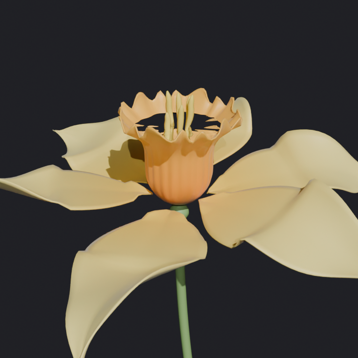
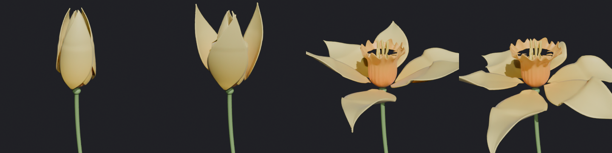
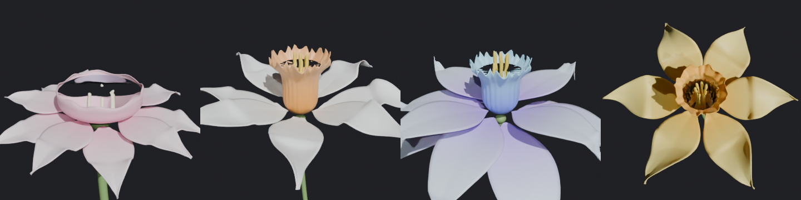

# Water Flower — 水をためる花 (Blender)

中央の **器（水をためる花びら）** に水がたまる花を作る Blender アドオンです。
器のまわりには、ねじれたり波打ったりする **遊びの花びら** が付きます。**つぼみにぎゅっと閉じるアニメーション** も作れます。
すべての部品は交差せず、少しすき間をあけて重なります。

つぼみ → 満開（「開き具合」0 / 0.3 / 0.75 / 1）:

プリセット（風呂 / 聖杯 / あそび / スイセンを上から見たところ。器の中に水が入っている）:

## 対応バージョン
- Blender 3.6 以降（5.0 ではスクリプトから動作を確認済み。画面上の UI はまだ実際に操作して確かめていない）

## インストール
1. `water_flower.zip` を `編集 > プリファレンス > アドオン` からインストールする（4.2 以降は `エクステンション` → 右上の ▼ → `ディスクからインストール`）
2. 3D ビューポートで `Shift+A > メッシュ > 水をためる花`、または `N` キー → **WaterFlower** タブ →「水をためる花」

## 使い方
- 花を選ぶと、サイドバーの **WaterFlower** タブに設定が出ます。値を変えるとその場で形が作り直されます
- **プリセット**：スイセン / 風呂 / 聖杯 / あそび
- **開き具合**：1 で満開、0 でつぼみ。スライダーで途中の形を確認できます
- パネルには **水位と容量** が出ます。水は `<花の名前>_Water` という別オブジェクトで、花の子になっています
- **交差チェック**：開き具合を 0〜1 の 6 段階に変えて、部品どうしが交差・接触していないか調べます

### つぼみアニメーション
1. 「つぼみ・アニメーション」パネルで **動き** を選ぶ（閉じる / 開く / 閉じて開く / 開いて閉じる）
2. 開始フレーム・動く長さ・止まる長さ・段階数を決める
3. **つぼみアニメーションを作成** を押す → 花と水にシェイプキーとキーフレームが入ります

途中の形を「段階数」ぶん記録して、そのあいだをなめらかにつなぎます。なので、どの PC でもそのままレンダリングできます。
アニメーションを作ったあとで設定を変えると、アニメーションは消えて「作り直してください」と出ます。

## しくみ
- **器**：底が閉じた 1 枚の回転面です。縁は切れ込み・フリル・筋で波打ちます。縁の高さは上から下へ単調になるように振れ幅を抑えているので、縁のいちばん低い所までは必ず水がたまります。水はその高さ（×満水率）までの器の内側の形から直接作るので、ボクセルは使いません
- **外側の花びら**：器を「厚み＋すき間」の分だけ太らせた形の外へ押し出して並べます。隣の花びらとは **角度に比例したずれ** で重ねるので、つぼみで巻き付いたときは らせん状にきれいに重なります。外の層は内の層の重なり幅より外側に置きます
- **あそび**（ねじれ・うねり・縁の波・ばらつき）は、隣の花びらと角度が重なっていない所から先にだけ効かせます。それでも近づいた所は、外側の層を外へ少し押し出します
- **つぼみ**：花びらが立ち上がって器を包み、先が軸の近くまで寄るように反りを自動で計算します。閉じるときは内側の層が先に閉じ、開くときは外側の層が先に開くので、途中でも突き抜けません

## 設定
| パネル | 主な項目 |
|---|---|
| 全体 | プリセット、シード、開き具合 |
| 器 | 半径、高さ、底の丸み、胴のふくらみ、縁の広がり、縁の切れ込み数・深さ、筋の数・深さ、縁のフリル・数、解像度 |
| 外側の花びら | 層の数、1 層の枚数、長さ、幅、最大幅の位置、先の尖り、付け根の細さ、開いた角度、反り、くぼみ、巻き付き、付く高さ、ねじれ（交互）、うねり、縁の波、ばらつき、外の層ほど倒す・長く・幅広く |
| つぼみ・アニメーション | つぼみの角度・閉じ具合・らせん・大きさ、器のすぼまり、層の時間差、動き、開始フレーム、長さ、段階数 |
| しべ・茎 | しべの数・高さ・広がり・曲がり・太さ・葯の太さ、茎の長さ・太さ・曲がり、子房 |
| 水・厚み・すき間 | 水の表示、満水率、縁との余裕、厚み（Solidify）、すき間、層のすき間、重なりのすき間 |
| 色 | 花びら（付け根・先）、器（底・縁）、しべ、茎。頂点カラー `wf_color` をマテリアルで使っています |

交差チェックで引っかかったときは、**すき間・重なりのすき間** を大きくするか、**ねじれ・うねり・ばらつき** を小さくしてください。
