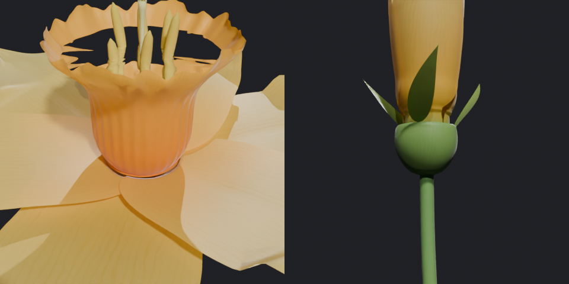

# Water Flower — 水をためる花 (Blender)

中央の **器（水をためる花びら）** に水がたまる花を作る Blender アドオンです。
器のまわりには **遊びの花びら** と **がく** が付きます。**つぼみにぎゅっと閉じるアニメーション** も作れます。
すべての部品は交差せず、浮いている部品もありません。花びらは子房の上から筒になって立ち上がり、がく・しべ・めしべもそれぞれ付け根で付いています。

器・しべ・めしべのアップと、つぼみを下から見たところ（子房・花びらの筒・がく）:

つぼみ → 満開（「開き具合」0 / 0.3 / 0.75 / 1）。つぼみでは器も底から縮みます:

プリセット（風呂 / 聖杯 / あそび / スイセンを上から見たところ。器の中に水が入っている）:

※ 画像は色管理なしの簡易レンダーなので、実際の Blender（AgX / Filmic）とは色味が少し違います。

## 対応バージョン
- Blender 3.6 以降（5.0 ではスクリプトから動作を確認済み。画面上の UI はまだ実際に操作して確かめていない）

## インストール
1. `water_flower.zip` を `編集 > プリファレンス > アドオン` からインストールする（4.2 以降は `エクステンション` → 右上の ▼ → `ディスクからインストール`）
2. 3D ビューポートで `Shift+A > メッシュ > 水をためる花`、または `N` キー → **WaterFlower** タブ →「水をためる花」

## 使い方
- 花を選ぶと、サイドバーの **WaterFlower** タブに設定が出ます。値を変えるとその場で形が作り直されます（1 回およそ 1 秒）
- **プリセット**：スイセン / 風呂 / 聖杯 / あそび
- **開き具合**：1 で満開、0 でつぼみ。スライダーで途中の形を確認できます
- パネルには **水位と容量** が出ます。水は `<花の名前>_Water` という別オブジェクトで、花の子になっています
- **交差チェック**：開き具合を 0〜1 の 6 段階に変えて、部品どうしが交差していないか調べます

### つぼみアニメーション
1. 「つぼみ・アニメーション」パネルで **動き** を選ぶ（閉じる / 開く / 閉じて開く / 開いて閉じる）
2. 開始フレーム・動く長さ・止まる長さ・段階数を決める
3. **つぼみアニメーションを作成** を押す → 花と水にシェイプキーとキーフレームが入ります

途中の形を「段階数」ぶん記録して、そのあいだをなめらかにつなぎます。なので、どの PC でもそのままレンダリングできます。
記録した形のあいだの、つないだ形（各段階の中間）も交差しないことを確かめています。
アニメーションを作ったあとで設定を変えると、アニメーションは消えて「作り直してください」と出ます。

## しくみ
- **器**：底が閉じた 1 枚の回転面です。縁はフリル・ちぢれ・切れ込みで波打ち、縦に筋があります。縁の高さは上から下へ単調になるように振れ幅を抑えているので、縁のいちばん低い所までは必ず水がたまります。水はその高さ（×満水率）までの器の内側の形から直接作ります
- **子房と花びらの筒**：茎の上の子房（卵形のふくらみ）の上面から、花びらが少し重なり合った筒になって器を包みながら立ち上がり、「開き始める高さ」から外へ開きます（スイセンの花の筒と同じ作り）。器と筒のすき間は器の付け根の細い輪でふさいでいます
- **重なり**：隣の花びらとは **角度に比例したずれ** で重ねるので、つぼみで巻き付いたときは らせん状にきれいに重なります。外の層は内の層より外側に置きます
- **あそび**（ねじれ・うねり・縁の波・横への流れ・ばらつき・細かい起伏）は、隣の花びらと重なっていない所から先にだけ効かせます。それでも近づいた所は、外側の層を外へ少し押し出します
- **がく**：子房のふちから出る緑の葉。開くと下へ反り返り、つぼみではつぼみの下を包みます
- **しべ・めしべ**：器の底の壁から立ちます。めしべの先は 3 つに分かれます。つぼみで閉じる花びらは、しべ・めしべもよけます
- **つぼみ**：器が底から縮み、口もすぼまります。花びらは立ち上がって器を包み、先が軸の近くまで寄るように反りを自動で計算します。閉じるときは内側の層が先に閉じ、開くときは外側の層が先に開くので、途中でも突き抜けません
- **質感**：厚みなしの面に、筋（葉脈）・長さ方向の濃淡・まだら・表皮の細胞の細かい凹凸・光の透け（裏から光が当たると明るく透ける）を付けたマテリアル。色は頂点カラー `wf_color` で付けています。マテリアルは花ごとに `WF_<花の名前>_Petal` などの名前で作られます

## 設定
| パネル | 主な項目 |
|---|---|
| 全体 | プリセット、シード、開き具合 |
| 器 | 半径、高さ、底の丸み、胴のふくらみ、縁の広がり、縁の切れ込み数・深さ、筋の数・深さ、縁のフリル・数、縁のちぢれ・数、解像度 |
| 外側の花びら | 層の数、1 層の枚数、長さ、幅、最大幅の位置、先の尖り、中央の筋、竜骨の折れ、縁の反り返り、先のくせ、細かい起伏、開いた角度、反り、くぼみ、巻き付き、開き始める高さ、花の筒の太さ、ねじれ（交互）、横への流れ、うねり、縁の波、ばらつき、外の層ほど倒す・長く・幅広く |
| がく | 数（0 でなし）、長さ、幅、角度、反り、くぼみ |
| つぼみ・アニメーション | つぼみの角度・閉じ具合・らせん・大きさ、器のすぼまり、つぼみの器の太さ・高さ、つぼみのがくの角度、層の時間差、動き、開始フレーム、長さ、段階数 |
| しべ・茎 | しべの数・高さ・広がり・曲がり・太さ・葯の太さ、めしべ・高さ、茎の長さ・太さ・曲がり、子房の太さ・長さ |
| 水・厚み・すき間 | 水の表示、満水率、縁との余裕、厚み（初期値 0 = 厚みなし。付けるとき Solidify）、すき間、層のすき間、重なりのすき間 |
| 色・質感 | 花びら（付け根・先）、器（底・縁）、葯、花糸、めしべ、がく（付け根・先）、子房、茎、筋の濃さ、透け感 |

交差チェックで引っかかったときは、**すき間・重なりのすき間** を大きくするか、**ねじれ・うねり・ばらつき** を小さくしてください。
厚みを付けるときは、**すき間** を厚みより大きくしてください。
