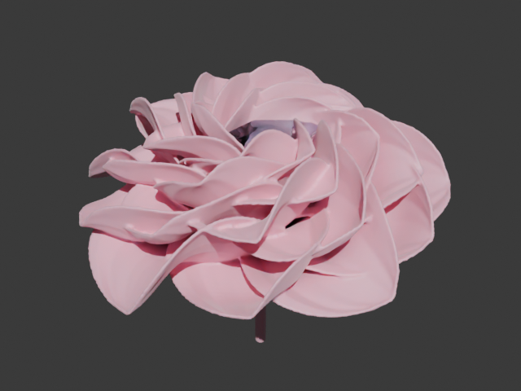
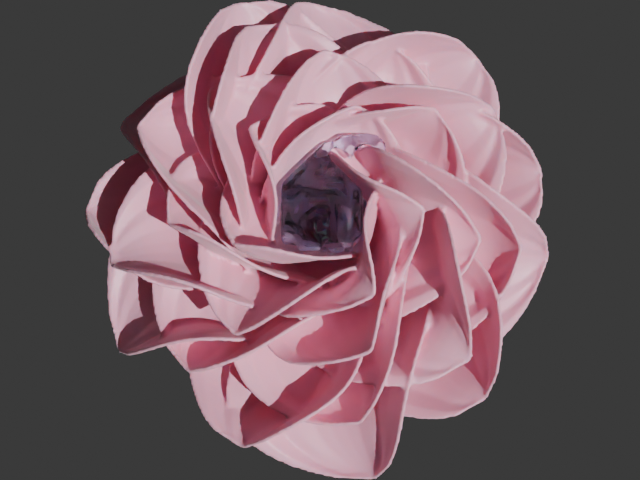

# Water Flower Petals（水をためる花）— Blender アドオン

絡み合った花びらを何層も重ねて、中央に風呂のような水たまりをつくる花を生成します。

| 斜めから | 上から（中央の青いものが水） |
|---|---|
|  |  |

## インストール
1. Blender の「編集 > プリファレンス > アドオン」で `water_flower_petals.py` を「ディスクからインストール」します（Blender 4.2 以降は右上の ▼ メニューにあります）。
2. 「Water Flower Petals（水をためる花）」を有効にします。

## 使い方
- **追加**: 3D ビューポートで `Shift+A > メッシュ > 水をためる花`、またはサイドバー（N）の **WaterFlower** タブから追加します。
  左下の「最後の操作を調整」パネル（F9）でパラメータをその場で変更できます。
- **水をためる**: 花を選択して「水をためる (Fill Water)」を押すと、花をボクセル化して
  「中央に注いだ水がどの高さまで漏れずにたまるか」を計算します。そのうえで水のオブジェクトを作り、水位・深さ・容量をレポートします。
  底に穴があって水がたまらない場合は警告が出ます。
- **流体シミュレーション準備**: Mantaflow のドメイン・注水口（指定したフレーム数だけ注水）・花のコリジョンを自動で設定します。
  ドメインを選んで Physics > Fluid > Bake All を押すと、実際に水を注いだ様子をシミュレーションできます。

## プリセット
| 名前 | 特徴 |
|---|---|
| 風呂型 | 標準。花びらがうねりながら上下に編み込まれた丸い風呂 |
| アナナス型 | 細長い葉が筒状に重なるタンク（パイナップル科の植物のような形） |
| 蓮型 | 浅く広い器 |
| 迷路型 | 強いねじれとフリルで複雑に絡まった形 |

## 主なパラメータ
- **配置**: 層の数、枚数、内層と外層の立ち上がり角（内側を立てるほど深い風呂になります）、黄金角配置、ばらつき
- **花びらの形**: 長さ、幅、最大幅の位置、先端の形、カップ（花びら 1 枚ずつのくぼみ）、反り
- **絡み**: ねじれ、うねり（隣どうしの花びらが互い違いに上下へ波打って編み込まれる）、横ゆらぎ、フリル
- **受け皿・茎**: 中心の底をふさぐお椀と茎
- **仕上げ**: 厚み（Solidify）、水密化（ボクセル Remesh で重なった花びらを一体化し、隙間をふさぎます）

水が漏れる場合は、内層の立ち上がり角・幅・受け皿の立ち上がりを大きくするか、水密化の Remesh ボクセルを小さくしてください。
