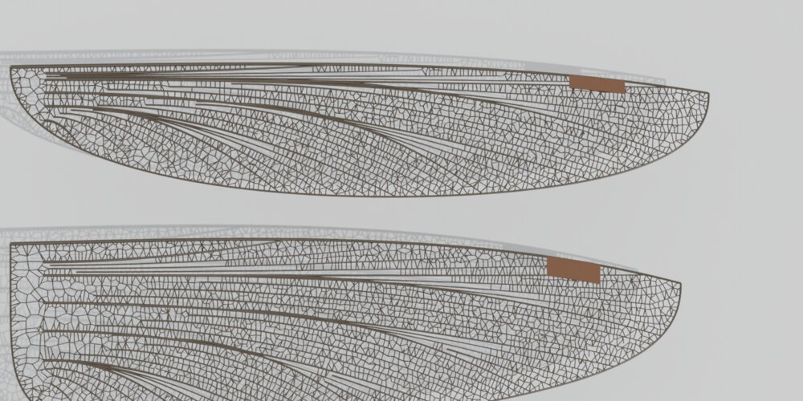
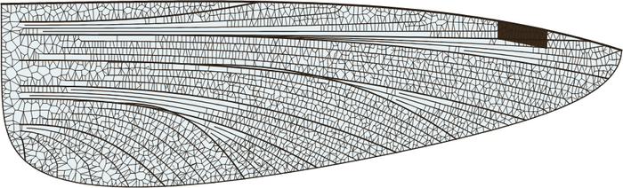
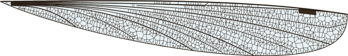
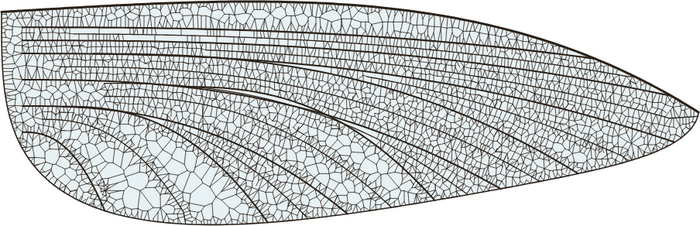
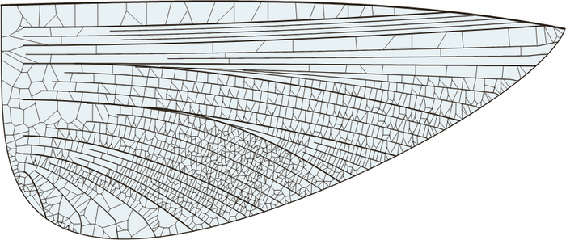

# Insect Wing Generator（Blender アドオン）

昆虫の翅（はね）を、翅脈パターンの発生モデルにしたがって手続き的に生成する Blender アドオンです。

参考論文:
Hoffmann, Donoughe, Li, Salcedo, Rycroft (2018)
*A simple developmental model recapitulates complex insect wing venation patterns*,
PNAS 115(40): 9905–9910. <https://www.pnas.org/doi/10.1073/pnas.1721248115>



## 実装したモデル

論文では、トンボなどの複雑な翅脈が「**既存の翅脈から出る抑制シグナル**」という単純なルールで説明できることが示されています。このアドオンでは翅脈を次の 3 段階で生成します。

1. **主脈（縦脈）**
   翅の付け根（hinge）から縁辺へ伸びる縦脈（前縁脈 C、亜前縁脈 Sc、径脈 R…臀脈）を作ります。亜前縁脈が前縁に達する位置が結節（nodus）になります。一部の脈は直前の脈から分岐します。
2. **介在脈（intercalary veins）**
   隣り合う縦脈の間隔が閾値を超えると、両側の脈から**最も遠い位置**（距離場の尾根）に新しい縦脈ができ、翅縁から付け根に向かって伸びます。間隔が `Gap Threshold × Stop Ratio` まで狭まると止まります。これを `Intercalary Levels` 回くり返します。
3. **横脈（cross veins）と翅室**
   - 翅をラスター化し、すべての翅脈・翅縁からのユークリッド距離場（＝抑制シグナルの弱さ）を計算します。
   - 抑制が最も弱い点（脈から最も遠い点）に翅室の「中心」を置き、置いた中心自身もまわりを抑制する、という操作をくり返します（貪欲な最遠点配置）。中心の間隔は局所的な脈間距離に比例し、上限が `Cell Size` です。
   - 縦脈で区切られた各領域の中で中心の**ボロノイ分割**を求め、その境界を横脈とします。

   この結果、狭い帯ではハシゴ状の横脈、広い領域では六角形に近い多角形の翅室ができ、論文が示したトンボの翅の特徴が再現されます。

| Dragonfly（後翅） | Damselfly |
|---|---|
|  |  |
| **Lacewing** | **Mayfly** |
|  |  |

## インストール

1. `insect_wing_generator.zip` をダウンロードします（このフォルダにあります）。
2. Blender の `Edit > Preferences > Add-ons` を開きます。
   - Blender 4.2 以降: 右上の `v` メニューから **Install from Disk…** を選びます。
   - Blender 3.x〜4.1: **Install…** を選びます。
3. zip を選んで、**Insect Wing Generator** を有効にします。

Blender 3.0 以降が対象で、Blender 5.0 で動作を確認しています。外部ライブラリは使いません。

## 使い方

- 3D ビューポートで `N` キーを押し、サイドバーの **Insect Wing** タブを開きます。
- `Preset`（Dragonfly / Damselfly / Lacewing / Mayfly）を選び、**Generate Insect Wings** を押します。
- `Shift+A > Mesh > Insect Wings` からも生成できます。
- 生成物は `InsectWings` コレクションに入ります。オブジェクト構成は Empty（全体）→ Empty（各翅）→ 翅膜メッシュ / 翅脈カーブ / 縁紋メッシュ です。
- `Seed` の横のボタンで乱数シードを変えて再生成します。

### 主なパラメータ

| グループ | パラメータ | 内容 |
|---|---|---|
| 全体 | Wings | 前翅のみ / 前翅＋後翅 / 4 枚（左右対称） |
| | Wing Length | 前翅の長さ（シーン単位） |
| Outline | Chord, Base/Tip Taper, Tip Drop | 翅の幅と輪郭 |
| Longitudinal Veins | Main Veins, Nodus Position, Branching, Vein Curvature | 主脈の本数・位置・分岐・曲がり |
| | Intercalary Levels / Gap Threshold / Stop Ratio | 介在脈ができる条件 |
| Cross Veins / Cells | Cell Size | 広い領域での翅室の最大半径（幅に対する比） |
| | Ladder Ratio | 狭い帯での横脈の間隔（脈間距離に対する比） |
| | Irregularity | 翅室の不規則さ |
| | Resolution | 距離場の解像度。上げると細かくなりますが遅くなります |
| | Pterostigma | 縁紋の有無・位置 |
| Hind Wing | Length, Chord Scale ほか | 前翅に対する後翅の違い |
| Shape & Material | Camber, Twist | 翅のそり・ねじれ |
| | Vein Thickness, Convert Veins to Mesh | 翅脈の太さ、メッシュへの変換 |
| | Membrane / Opacity / Iridescence | 翅膜の色・透明度・薄膜干渉（Blender 4.2 以降の Principled BSDF の Thin Film を使用） |

## ファイル構成

```
blender_insect_wing/
├── insect_wing_generator/      アドオン本体
│   ├── __init__.py             UI・オペレーター・プロパティ
│   ├── venation.py             翅脈生成アルゴリズム（bpy 非依存の純 Python）
│   └── builder.py              Blender のメッシュ・カーブ・マテリアル生成
├── insect_wing_generator.zip   インストール用 zip
├── tools/preview_svg.py        Blender なしで翅脈パターンを SVG に出力
└── images/                     サンプル画像
```

`venation.py` は Blender に依存しないので、`python3 tools/preview_svg.py DRAGONFLY_FORE` のように実行してパターンだけを確認できます。
