# Insect Wing Generator（Blender アドオン）

昆虫の翅（はね）を手続き的に生成する Blender アドオンです。

| モデル | 対象 | 仕組み |
|---|---|---|
| **Diptera / Developmental** ※既定 | アブ・イエバエ・ハナアブ | 位置情報場・モルフォゲンの閾値・脈の挿入と融合・BMP 型の横脈という発生の仕組みから翅脈を**育てる** |
| Diptera / Atlas | 同上 | 科ごとに決まった脈を、測った位置に**置く**（比較用） |
| Odonata / 網目状の翅脈 | トンボ・イトトンボ・クサカゲロウ・カゲロウ | 抑制シグナルとボロノイ分割で翅脈を育てる（PNAS 2018） |

## 双翅目の翅脈はどう決まっているのか

「何本の脈があって部屋がいくつ」という**設計図**なのか、脈の**自然な流れ**なのか、という問いに対しては「両方。ただし役割が違う」が答えになります。ショウジョウバエなどの発生研究で分かっていることを整理します。

1. **脈の数と順番は遺伝的な前パターンで決まる（設計図の側面）**
   翅原基は前後（A/P）の区画境界を持っています。後区画からの Hedgehog と、境界から出る Dpp（BMP）の濃度勾配に対して、*spalt*・*optomotor-blind*・*knot* などの遺伝子が**閾値**で応答します。L2〜L5 の縦脈は、それらの発現境界に現れます。脈の数・順番・相同性（R・M・Cu…）がほぼ一定で、分類に使えるのはこのためです。
2. **脈の形そのものは組織の変形と流れで決まる（流れの側面）**
   蛹期に翅の付け根（ヒンジ）が収縮し、翅身は基部から先端へ引き伸ばされます。原基の中ではまっすぐだった A/P の位置の線が、この組織の流れによって**基部で収束し、先端で扇状に開く曲線**になります。脈は血リンパや気管の通り道でもあり、流れの線に沿って伸びます。
3. **分岐・融合・横脈は局所的な自己組織化で決まる**
   脈の幅は EGFR と Notch の側方抑制で細く保たれます。脈どうしの間が広すぎると新しい脈が挿入され（Hoffmann ら 2018 が示したトンボの介在脈と同じ規則）、狭くなると隣と融合します（R2+3、R4+5 という名前は「融合した脈」という意味です）。横脈（r-m、dm-cu）は、両側の脈から運ばれた BMP が重なる場所にだけできます。

つまり**「どの系統の脈が何本あるか」は少数の閾値で離散的に決まり、「どこをどう走って、どこで分かれ、どこがつながり、部屋がどんな形になるか」は連続的な場と局所規則から自然に生じます。**後者はアルゴリズムで近似できます。それが Developmental モデルです。

## Diptera / Developmental モデル

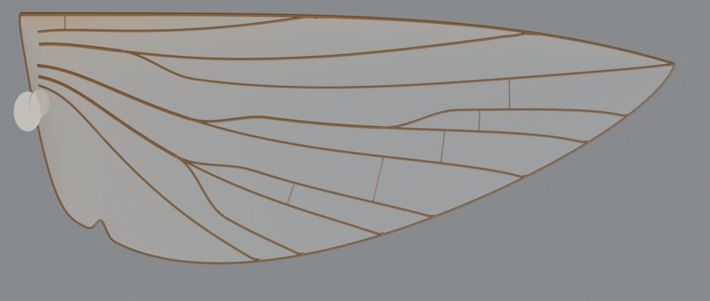

脈の名前も位置も一切指定しません。次の 6 つの仕組みだけで翅脈が生じます（`fly_dev.py`）。

| # | 仕組み | 実装 |
|---|---|---|
| 1 | **位置情報場 ψ** | 翅縁（元の D/V 境界）が A/P の位置の値を持ちます（前縁基部 0 → 後縁基部 1）。翅身の内部では ∇·(σ∇ψ)=0 を解きます。σ は後部組織の余分な成長で、σ が大きい所では値が薄く引き伸ばされ、脈の間隔が広がります。ヒンジでは ψ が 0→1 に圧縮されるので、全系統が細い付け根に順番どおり収束します。 |
| 2 | **モルフォゲン閾値** | A/P 境界に峰を持つ Dpp 型の勾配を、5 つの固定閾値で読み取って Sc・R・M・Cu・A の 5 系統を決めます。各脈は「ψ = 閾値」の等値線として、翅縁からヒンジへ伸びます。等値線なので**脈は交差せず**、前縁脈には浅い角度で寄り添います。 |
| 3 | **挿入と融合** | 翅縁上で、どの脈からも一定距離以上離れた点に新しい脈が生じます（PNAS 2018 の規則）。新しい脈は等値線に沿って基部へ伸び、両隣との隙間が閾値より狭くなった所で近いほうに融合します。これで Rs→R2+3／R4+5、M の分岐などの**枝分かれ**が生じます。Sc と A は分岐しません。すぐに融合してしまう短い原基は脈になりません。 |
| 4 | **横脈（BMP）** | 隣り合う脈が十分近く、かつ Dpp/BMP が高い（A/P 境界に近い）所にだけ、側方抑制つきで横脈ができます。これが r-m・dm-cu・bm-cu にあたり、**盤室などの閉じた部屋**ができます。 |
| 5 | **末端融合** | 翅縁での終点が近い隣どうしは共通の柄になって融合し、間の部屋を閉じます（CuA2 + A1 による**肘室 cup**）。 |
| 6 | **脈の太さ（マレーの法則）** | 各区間は、そこより先のすべての枝の「流量」を運び、半径は流量^(1/3) に比例します。基部の太い幹から細い枝へ、自然な太さの階層ができます。 |

位置情報場 ψ の等値帯（脈はこの線のどれかの上にできます）:

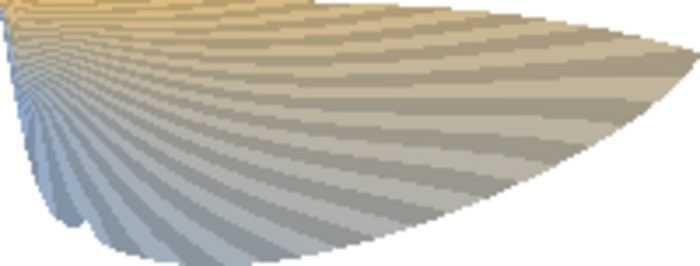

### 科の違い＝パラメータの違い

3 つの科は**同じ仕組み**で作り、勾配と閾値のパラメータだけを変えています。

| 科 | 結果 | 主な違い |
|---|---|---|
| アブ科 | 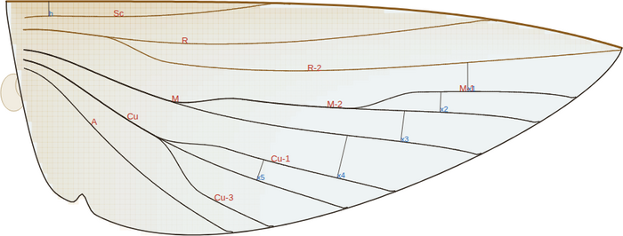 | 挿入の閾値が低いので枝が多い。末端融合で cup が閉じる。前縁脈が翅を一周する |
| イエバエ科 | 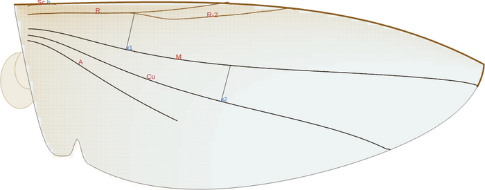 | 挿入の閾値が高いので枝が少ない。A1 が途中で消える。横脈は r-m と dm-cu の 2 本だけ |
| ハナアブ科 | 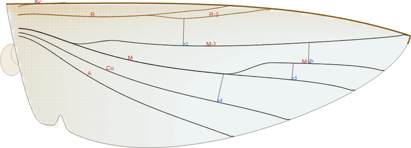 | 中間 |

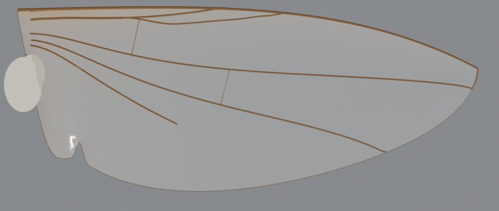

### Development パラメータ

| パラメータ | 意味 |
|---|---|
| A/P Boundary, Dpp Range Anterior/Posterior | Dpp 勾配の峰の位置と広がり。各系統の脈がどこに来るかを決める |
| Posterior Margin Growth | 後縁が持つ位置の値の密度。上げると脈が後縁に急な角度で当たる |
| Posterior Tissue Growth | 後部組織の膨張。上げると脈が前方に集まり、後方の部屋が広くなる |
| Branching Gap / Fusion Gap / Branching Rounds / Min Branch Length | 脈の挿入と融合の閾値。枝の数と分岐の位置が決まる |
| Cross Vein Range / Competence / per Pair | 横脈ができる距離、BMP の必要量、1 組あたりの本数 |
| Distal Fusion | 翅縁での融合距離（cup を閉じるか） |
| Anal Vein Reach | A1 のうち硬化する長さ |
| Costa End, Circumambient Costa | 前縁脈の範囲 |

### 限界

- 前パターンは 1 本の勾配と固定閾値だけなので、イエバエ科・ハナアブ科の Sc は実物より基部寄りで終わります。
- イエバエ科の M1 の屈曲、ハナアブ科の偽脈（vena spuria）、アブ科の R4 付属脈は、今の規則では出てきません（Atlas モデルにはあります）。
- 翅の輪郭そのものは育てておらず、パラメトリックな形を使っています。

## Diptera / Atlas モデル

科ごとの標準的な脈相を、実物の位置に置くモデルです。Developmental モデルとの比較用に残しています。

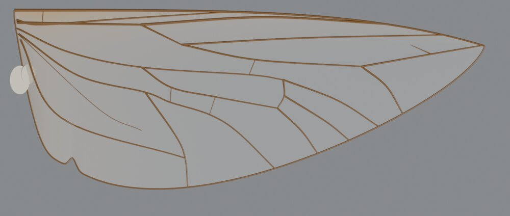

### 生物学的な考え方

双翅目の翅はトンボと違い、横脈の網目をほとんど持ちません。**少数の決まった縦脈と横脈**でできていて、その配置は科ごとにほぼ一定です（分類の検索に使われるほどです）。そのため、このモデルでは抑制・ボロノイの成長モデルは使いません。Comstock–Needham 式の脈の名前（現行の双翅目用語）ごとに、分岐と接続の関係（トポロジー）を組み立てます。

| 部位 | 内容 |
|---|---|
| **C（前縁脈）** | 前縁の太い脈。アブ科では翅をぐるりと一周し（後縁では細い）、イエバエ科では M1 の終点で終わる |
| **h（肩横脈）** | 基部で C と Sc をつなぐ |
| **Sc（亜前縁脈）** | 翅の中ほどで C に合流する |
| **R1** | 太く硬い第 1 径脈。C に合流する |
| **Rs → R2+3 / R4+5** | 径分脈。アブ科では R4+5 がさらに R4 と R5 に分かれて翅端をはさみ、R4 には短い**付属脈（appendix）**がある |
| **r-m** | 径脈と中脈をつなぐ横脈 |
| **M（中脈）と dm（盤室）** | 閉じた盤室 dm から M1・M2・M3 が翅縁へ伸びる（アブ科）。イエバエ科では M1 が前方へ強く曲がって R4+5 に近づく |
| **bm-cu / dm-cu** | 基中室 bm と盤室 dm を閉じる横脈 |
| **CuA1 / CuA2** | 前肘脈。CuA2 は A1 と合流して**肘室 cup を閉じる**（アブ科・ハナアブ科では翅縁近く、イエバエ科では基部近くの短い室） |
| **CuP** | 弱い後肘脈。折れ線のような細い脈 |
| **A1（第 1 臀脈）** | アブ科では翅縁まで達し、イエバエ科では途中で消える |
| **翅室の色素** | 基部と前縁側の室が琥珀色に着色する（頂点カラー `WingTint` で翅膜マテリアルに反映） |
| **小翅片（alula）** | 後縁基部の小さな葉片。前に切れ込み（alular incision）がある |
| **胸弁（calypter）** | 翅の付け根で体側にある 2 枚のフラップ。下胸弁は平均棍を覆う（有弁類＝イエバエ科で大きい） |
| **平均棍（haltere）** | 双翅目の後翅は退化して棍棒状の平衡器官になっている。翅は 1 対だけを作り、後翅の位置には平均棍を置く |

アブ科のテンプレートは、提示された *Tabanus* の写真から節点の位置を測って作りました（翅の付け根→翅端の座標系に回転して計測）。

### 科のプリセット

| アブ科 Tabanidae | イエバエ科 Muscidae |
|---|---|
| 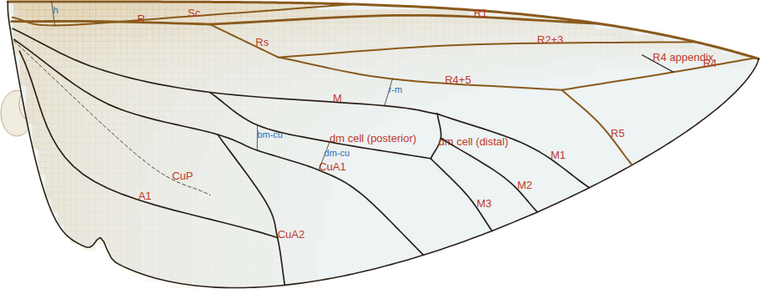 | 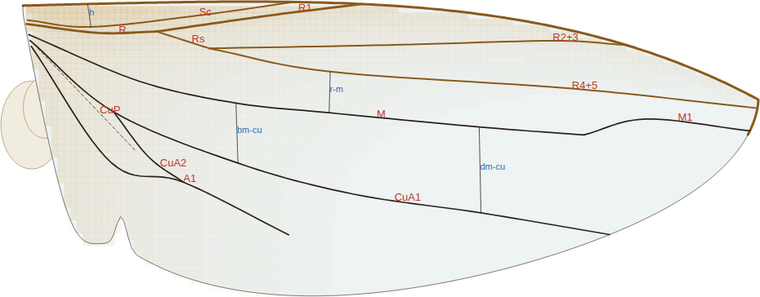 |
| **ハナアブ科 Syrphidae** | 特徴 |
| 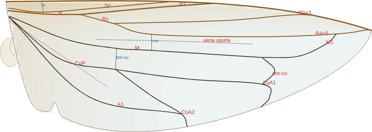 | **偽脈（vena spuria）**がある。M1 が前方へ曲がって R4+5 に合流し、dm-cu・CuA1 とともに翅縁と平行な「偽の翅縁」を作る |

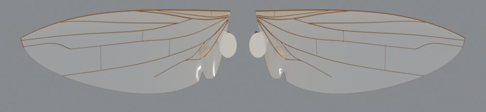

### Diptera のパラメータ

| パラメータ | 内容 |
|---|---|
| Family | アブ科 / イエバエ科 / ハナアブ科。輪郭・小翅片・胸弁の初期値も切り替わる |
| Chord, Base/Tip Taper, Apex Position | 翅の輪郭 |
| Alula, Alula Position | 小翅片の大きさと位置 |
| Calypters | 胸弁の大きさ（0 で作らない） |
| R4 Appendix | R4 の付属脈の有無 |
| Individual Variation | 脈の分岐点や合流点を乱数で少しずらし、個体差を出す |
| Pigmentation, Pigment | 基部と前縁側の室の着色の強さと色 |
| Halteres | 平均棍の有無（Wings を One Side / Both Sides にしたとき） |

---

## Odonata（網目状の翅脈）モデル

参考論文:
Hoffmann, Donoughe, Li, Salcedo, Rycroft (2018)
*A simple developmental model recapitulates complex insect wing venation patterns*,
PNAS 115(40): 9905–9910. <https://www.pnas.org/doi/10.1073/pnas.1721248115>


### 実装したモデル

論文では、トンボなどの複雑な翅脈が「**既存の翅脈から出る抑制シグナル**」という単純なルールで説明できることが示されています。このアドオンでは翅脈を次の 3 段階で生成します。

1. **主脈（縦脈）**
   翅の付け根（hinge）から縁辺へ伸びる縦脈（前縁脈 C、亜前縁脈 Sc、径脈 R…臀脈）を作ります。亜前縁脈が前縁に達する位置が結節（nodus）になります。一部の脈は直前の脈から分岐します。
2. **介在脈（intercalary veins）**
   隣り合う縦脈の間隔が閾値を超えると、両側の脈から**最も遠い位置**（距離場の尾根）に新しい縦脈ができ、翅縁から付け根に向かって伸びます。間隔が `Gap Threshold × Stop Ratio` まで狭まると止まります。これを `Intercalary Levels` 回くり返します。
3. **横脈（cross veins）と翅室**
   - 翅をラスター化し、すべての翅脈・翅縁からのユークリッド距離場（＝抑制シグナルの弱さ）を計算します。
   - 抑制が最も弱い点（脈から最も遠い点）に翅室の「中心」を置き、置いた中心自身もまわりを抑制する、という操作をくり返します（貪欲な最遠点配置）。中心の間隔は局所的な脈間距離に比例し、上限が `Cell Size` です。
   - 縦脈で区切られた各領域の中で中心の**ボロノイ分割**を求め、その境界を横脈とします。

   この結果、狭い帯ではハシゴ状の横脈、広い領域では六角形に近い多角形の翅室ができ、論文が示したトンボの翅の特徴が再現されます。

| Dragonfly（後翅） | Damselfly |
|---|---|
|  |  |
| **Lacewing** | **Mayfly** |
|  |  |

## インストール

1. `insect_wing_generator.zip` をダウンロードします（このフォルダにあります）。
2. Blender の `Edit > Preferences > Add-ons` を開きます。
   - Blender 4.2 以降: 右上の `v` メニューから **Install from Disk…** を選びます。
   - Blender 3.x〜4.1: **Install…** を選びます。
3. zip を選んで、**Insect Wing Generator** を有効にします。

Blender 3.0 以降が対象で、Blender 5.0 で動作を確認しています。外部ライブラリは使いません。

## 使い方

- 3D ビューポートで `N` キーを押し、サイドバーの **Insect Wing** タブを開きます。
- `Insect` で **Diptera (flies)** を選ぶ場合は `Family` と `Method`（Developmental / Atlas）を、**Odonata / net-veined** を選ぶ場合は `Preset`（Dragonfly / Damselfly / Lacewing / Mayfly）を選び、**Generate Insect Wings** を押します。
- `Wings` は Single Wing（1 枚）/ One Side（片側。トンボは前翅＋後翅、ハエは翅＋平均棍）/ Both Sides（左右対称）から選びます。
- `Shift+A > Mesh > Insect Wings` からも生成できます。
- 生成物は `InsectWings` コレクションに入ります。オブジェクト構成は Empty（全体）→ Empty（各翅）→ 翅膜メッシュ / 翅脈カーブ / 縁紋メッシュ（トンボ）・胸弁と平均棍（ハエ）です。
- `Seed` の横のボタンで乱数シードを変えて再生成します。

### 主なパラメータ（Odonata）

| グループ | パラメータ | 内容 |
|---|---|---|
| 全体 | Wings | 前翅のみ / 前翅＋後翅 / 4 枚（左右対称） |
| | Wing Length | 前翅の長さ（シーン単位） |
| Outline | Chord, Base/Tip Taper, Tip Drop | 翅の幅と輪郭 |
| Longitudinal Veins | Main Veins, Nodus Position, Branching, Vein Curvature | 主脈の本数・位置・分岐・曲がり |
| | Intercalary Levels / Gap Threshold / Stop Ratio | 介在脈ができる条件 |
| Cross Veins / Cells | Cell Size | 広い領域での翅室の最大半径（幅に対する比） |
| | Ladder Ratio | 狭い帯での横脈の間隔（脈間距離に対する比） |
| | Irregularity | 翅室の不規則さ |
| | Resolution | 距離場の解像度。上げると細かくなりますが遅くなります |
| | Pterostigma | 縁紋の有無・位置 |
| Hind Wing | Length, Chord Scale ほか | 前翅に対する後翅の違い |
| Shape & Material | Camber, Twist | 翅のそり・ねじれ |
| | Vein Thickness, Convert Veins to Mesh | 翅脈の太さ、メッシュへの変換 |
| | Membrane / Opacity / Iridescence | 翅膜の色・透明度・薄膜干渉（Blender 4.2 以降の Principled BSDF の Thin Film を使用） |

## ファイル構成

```
blender_insect_wing/
├── insect_wing_generator/      アドオン本体
│   ├── __init__.py             UI・オペレーター・プロパティ
│   ├── fly_dev.py              双翅目の発生モデル（numpy。Blender に同梱）
│   ├── diptera.py              双翅目の Atlas モデル（脈相テンプレート、bpy 非依存）
│   ├── venation.py             トンボ型の翅脈成長アルゴリズム（bpy 非依存の純 Python）
│   └── builder.py              Blender のメッシュ・カーブ・マテリアル生成
├── insect_wing_generator.zip   インストール用 zip
├── tools/preview_svg.py        Blender なしで翅脈パターンを SVG に出力
└── images/                     サンプル画像
```

`venation.py`・`diptera.py`・`fly_dev.py` は Blender に依存しないので（`fly_dev.py` には numpy が必要。`python3 tools/preview_svg.py --labels DEV_TABANIDAE`）、`python3 tools/preview_svg.py --labels TABANIDAE` や `python3 tools/preview_svg.py DRAGONFLY_FORE` のように実行してパターンだけを確認できます（`--labels` を付けると脈の名前が入ります）。
