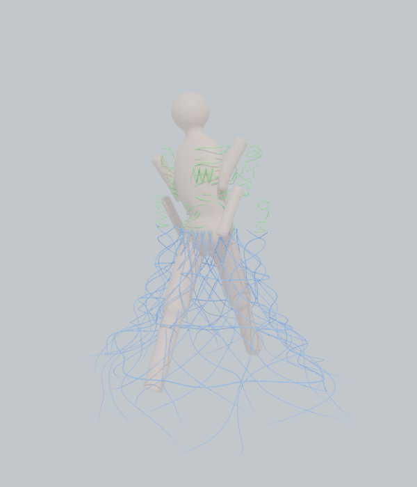

# Vine Dress — つる植物ドレス生成アドオン (Blender)

人物メッシュの表面につる植物を這わせて服のように体を覆い、水につかっている腰から下は
スカートのように広がる構造を生成する Blender アドオンです。生成したつるは人物のアニメーションに追従します。

つるは **ガイドカーブ** をもとに作られます。ガイドは自動生成も手描きもでき、普通のカーブとして自由に編集できるので、
つるの流れ・密度・太さを自分でコントロールできます。

| ① ガイドカーブ（緑=体表面 / 青=スカート） | ② ガイドから生成したつる |
|---|---|
|  |  |

## 対応バージョン
- Blender 3.6 〜 4.x（4.2 LTSで動作確認済み）

## インストール
1. `vine_dress.zip` をダウンロード（このフォルダにあります。`vine_dress/` フォルダをzipにしても可）
2. Blender → `編集 > プリファレンス > アドオン`（4.2以降は `エクステンション` 右上の ▼ → `ディスクからインストール`）
3. zip を選んで有効化
4. 3Dビューポートで `N` キー → サイドバーの **Vine Dress** タブ

## 使い方（2段階）
### 準備
1. 人物メッシュを選択し、スポイトボタンで「人物メッシュ」に設定
2. **高さ・水面** で水面の高さ（＝スカートの開始位置）を設定。3Dカーソルボタンでカーソルの高さを取り込める。水面用の平面オブジェクトを指定してもOK
3. **レストポーズ切替** で人物をレストポーズにしておくと、ガイドを編集しやすい（ガイドはレストポーズ基準）

### ① ガイドカーブ
- **ガイドを自動生成**: 体表面を這う「上半身ガイド」と、ベル形に広がる「スカートガイド」を作ります
  - `<人物名>_VineGuides` コレクションに `_Guide_Body`（緑）/ `_Guide_Skirt`（青）として作られ、人物の子になります
  - 「自動ガイドを置き換え」がオンなら、作り直しても手描きのガイドは消えません
- **編集**: 普通のベジェカーブとして自由に編集できます
  - 制御点の移動・削除・追加、スプラインの削除（いらないつるを消す）
  - **制御点の半径（Alt+S）= つるの太さ**。根元を太く、先を細く、などが可能
  - 体にめり込んだり浮いたりしたら **ガイドを体に吸着** で表面に戻せます（選択中のガイド、未選択なら全て）
- **手で描く**:
  - **体表面に描く**: 新しいガイドを作って描画ツールに切り替えます。体の上をドラッグすると表面に沿って描けます（既存のつるメッシュは自動で非表示になります）
  - **空間に描く**: 3Dカーソルの奥行きの平面に描きます。スカートや水中に漂うつる向け
  - 描き終わったら `Tab` でオブジェクトモードに戻る
- **選択中のガイド** パネル（ガイドオブジェクトごとの設定）
  - 使用 オン/オフ、種類（体表面 / スカート・空間）、太さ倍率、葉の量倍率、絡むつるの本数

### ② つる生成
- **ガイドからつるを生成** で、すべての（使用オンの）ガイドからつる・葉・巻きひげのメッシュを作ります
  - 「体表面」ガイドは生成時に体へ吸着（オフにすると描いた位置そのまま）
  - **1ガイドのつる本数** を増やすと、ガイドに沿って複数のつるが絡み合います（体表面では肌にめり込まない編み方）
  - **巻きひげ** がガイドから螺旋状に伸びます
- ガイドを直したら、もう一度「ガイドからつるを生成」を押すだけで作り直せます

**おまかせ一括生成** を押すと、①の自動生成と②をまとめて行います。

## 仕組み
| 部分 | 内容 |
|---|---|
| 上半身ガイドの自動生成 | 体表面上を少しずつ伸びる成長シミュレーション。体に巻き付く方向・上下傾向・うねりで進む方向を決め、他のつると近すぎる方向は避ける。「被覆パス」で隙間を探してつるを足し、服のように全体を覆う |
| スカートガイドの自動生成 | 水面（腰）から裾に向かってベル形に広がる縦つる（右巻き/左巻きを交互にした網目）と横つる。脚の外形より内側には入らない |
| つる | ガイドを等間隔に再サンプリングし、チューブメッシュにする。太さ＝基本の太さ × ガイドの倍率 × 制御点の半径 |
| 葉 | つるに沿って交互に生える。UVは葉1枚ごとに0〜1なので、葉のテクスチャ（アルファ付き）も貼れる |
| 色 | 頂点カラー `vine_color` に茎・葉ごとの色のばらつきを入れてある。マテリアル `VineDress_Stem` / `VineDress_Leaf` がこれを参照 |

### アニメーション追従
- **アーマチュア（推奨）**: 人物のボーンウェイトをつるに写して、同じアーマチュアの Armature モディファイアで変形します。
  - 「体表面」ガイドのつる: 接している体表面のウェイトを使う
  - 「スカート/空間」ガイドのつる: 下へ行くほど腰（骨盤）のウェイトに寄せ、隣り合うつる同士でなじませてあるので、歩いても裾が脚の間で裂けません（「腰への固定度」で調整）
- **サーフェス変形**: Surface Deform で人物メッシュにバインドします。シェイプキーや Alembic キャッシュでアニメーションしている人物向け。
- 「レストポーズで生成」がオンなら、生成・吸着・バインドのときは一時的にレストポーズにしてから処理します。

### 水中のゆらめき
水面より下の頂点には `VineSway` 頂点グループの重みが入り（裾ほど強い）、Displace モディファイア＋Cloudsノイズで揺れます。
ノイズを動かしているのは `*_SwayDriver` エンプティで、ドライバー（`frame*速度`）で移動します。

## コツ
- **顔・手を避けて自動生成したい**: 人物に頂点グループを作り、つるを生やしたい部分だけウェイト1を塗って「生成範囲グループ」に指定する
- **腕がスカートに干渉する**（腕を下ろしたポーズ）: 腰と脚だけの頂点グループを作り、「スカート追従グループ」に指定する
- **自動生成は大まかに、仕上げは手で**: 自動生成のあと、不要なスプラインを消し、目立たせたい流れを「体表面に描く」で足す
- **自動ガイドの制御点が多すぎる/少なすぎる**: 「自動生成: 上半身」の「制御点の間隔」を調整する
- 長さの値は「身長で自動スケール」がオンのとき身長1.7m基準。モデルのスケールが違ってもそのまま使える
- 重いとき: 「断面分割数」「1ガイドのつる本数」「葉の密度」を下げる

## ファイル構成
```
vine_dress/
  __init__.py      登録
  properties.py    シーン設定
  guides.py        ガイドカーブ（作成・読み込み・吸着、ガイドごとの設定）
  build.py         ガイド → つるの中心線（絡むつる・巻きひげ・ウェイト）
  sampler.py       体表面のBVH検索、法線/ウェイトの補間
  growth.py        上半身ガイドの成長シミュレーション
  skirt.py         スカートの形状とウェイト
  meshgen.py       チューブ・葉のメッシュ生成
  binding.py       アーマチュア/サーフェス変形、ゆらめき、マテリアル
  operators.py     オペレーター
  ui.py            サイドバーUI
```
