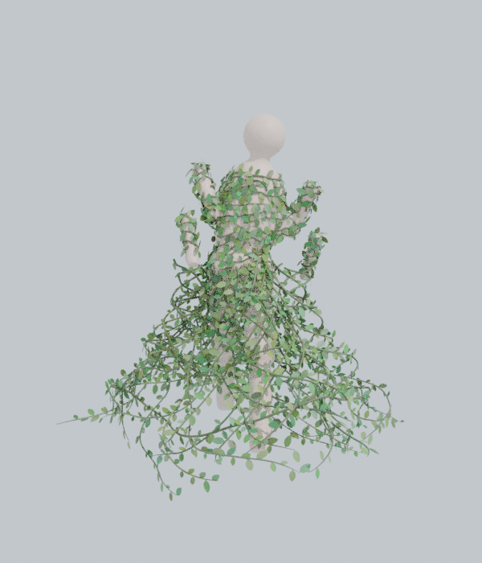

# Vine Dress — つる植物ドレス生成アドオン (Blender)

人物メッシュの表面につる植物を這わせて服のように体を覆い、水につかっている腰から下は
スカートのように広がる構造を生成する Blender アドオンです。生成したつるは人物のアニメーションに追従します。



## 対応バージョン
- Blender 3.6 〜 4.x（4.2 LTSで動作確認済み）

## インストール
1. `vine_dress.zip` をダウンロード（このフォルダにあります。`vine_dress/` フォルダをzipにしても可）
2. Blender → `編集 > プリファレンス > アドオン`（4.2以降は `エクステンション` 右上の ▼ → `ディスクからインストール`）
3. zip を選んで有効化
4. 3Dビューポートで `N` キー → サイドバーの **Vine Dress** タブ

## 使い方
1. 人物メッシュを選択し、スポイトボタンで「人物メッシュ」に設定
2. **高さ・水面** で水面の高さを設定（身長に対する割合。3Dカーソルボタンでカーソルの高さを取り込める。水面用の平面オブジェクトを指定してもOK）
3. **つるの衣装を生成** を押す

生成物は `<人物名>_VineDress` という1つのメッシュ（つる＋葉）で、人物の子になります。

## 仕組み
| 部分 | 内容 |
|---|---|
| 上半身のつる | 体表面上を少しずつ伸びる成長シミュレーション。体に巻き付く方向・上下傾向・うねりで進行方向を決め、他のつると近すぎる方向は避ける。「被覆パス」で隙間を探して新しいつるを追加し、服のように全体を覆う |
| 水中スカート | 水面（腰）から裾に向かってベル形に広がる縦つる（右巻き/左巻きで網目状に編み込み）＋横つる。脚の外形より内側には入らない |
| 葉 | つるに沿って交互に生える。UVは葉1枚ごとに0〜1なので葉テクスチャ（アルファ付き）も貼れる |
| 色 | 頂点カラー `vine_color` に茎・葉ごとの色のばらつきを格納。マテリアル `VineDress_Stem` / `VineDress_Leaf` が参照 |

### アニメーション追従
- **アーマチュア（推奨）**: 人物のボーンウェイトを、つるの各点が接している体表面から転写し、同じアーマチュアの Armature モディファイアで変形します。
  スカートは下へ行くほど腰（骨盤）のウェイトに寄せ、角度方向にぼかしてあるので、歩いても裾が脚の間で裂けません（「腰への固定度」で調整）。
- **サーフェス変形**: Surface Deform で人物メッシュにバインド。シェイプキーや Alembic キャッシュでアニメーションしている人物向け。
- どちらも「レストポーズで生成」がオンなら、生成・バインド時に一時的にレストポーズにしてから行います。どのフレームで生成しても問題ありません。

### 水中のゆらめき
水面より下の頂点は `VineSway` 頂点グループに重みが入り（裾ほど強い）、Displace モディファイア＋Cloudsノイズで揺れます。
ノイズは `*_SwayDriver` エンプティがドライバー（`frame*速度`）で移動することで時間変化します。

## コツ
- **顔・手を覆いたくない**: 人物に頂点グループ（例: `VineMask`）を作り、つるを生やしたい部分だけウェイト1を塗って「生成範囲グループ」に指定
- **腕がスカートに干渉する**（腕を下ろしたポーズ）: 腰と脚だけの頂点グループを作って「スカート追従グループ」に指定
- **もっと密に覆う**: 「つる間隔」を小さく、「被覆パス数」「葉の密度」「葉の大きさ」を大きく
- **ボリューム重視**: 「広がり」「広がりカーブ」でベル形、「フリル」で裾の波打ち
- 長さ系の値は「身長で自動スケール」がオンのとき身長1.7m基準。小さい/大きいスケールのモデルでもそのまま使えます
- 重い場合は「断面分割数」を減らす、または葉の密度を下げる

## ファイル構成
```
vine_dress/
  __init__.py      登録
  properties.py    設定項目
  sampler.py       体表面のBVH検索・法線/ウェイト補間
  growth.py        上半身のつる成長
  skirt.py         スカート形状とウェイト
  meshgen.py       チューブ・葉メッシュ生成
  binding.py       アーマチュア/サーフェス変形・ゆらめき・マテリアル
  operators.py     生成/削除オペレーター
  ui.py            サイドバーUI
```
