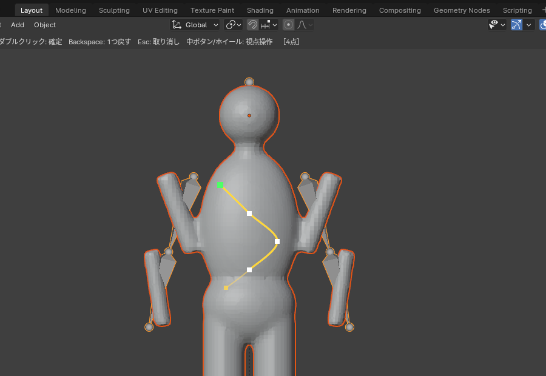

# Vine Wrap — つる植物を絡ませる Blender アドオン

オブジェクトに **ガイドカーブ** を作り（Maya のカーブツールのようにクリックで点を打つ、または自動生成）、つる植物を絡ませます。
ガイドは1本ずつ名前の付いたカーブで、編集モードに入らずに点の追加・移動・削除ができます。
対象がアーマチュアなどでアニメーションしていても、つるが追従します。


| カーブ作成（クリックで点を打つ） | ポイント編集（白=制御点, 緑=根元） | サイドバー |
|---|---|---|
|  |  |  |

## 対応バージョン
- Blender 3.6 以降（4.0 で実際の画面を操作して、4.2 LTS ではスクリプトから動作確認済み。5.x は未確認）

## インストール
1. `vine_wrap.zip` を使う（`vine_wrap/` フォルダを zip にしても可）
2. `編集 > プリファレンス > アドオン` からインストールして有効化（4.2 以降は `エクステンション` 右上の ▼ → `ディスクからインストール`）
3. 3Dビューポートで `N` → **Vine Wrap** タブ。ツールバー（左端）に2つのツールが追加されます

## 使い方
1. つるを絡ませたいメッシュを選び、スポイトボタンで **対象** に設定
2. ガイドを作る（どちらか、または両方）
   - **手で作る**: 「カーブ作成」ツールでクリックして点を打ち、Enter で確定
   - **自動生成**: 「自動生成」パネルの **ガイドを自動生成**
3. 「ポイント編集」ツールでガイドを整える
4. つるは自動で作り直されます（「自動更新」オフなら **つるを生成** を押す）

## ツール（すべてオブジェクトモードのまま使える）
| ツール | 操作 |
|---|---|
| **カーブ作成** | クリックするたびに点を追加（Maya のカーブツールのように）。打った点がそのまま制御点になり、なめらかな曲線でつながる<br>対象の上をクリック: 表面に吸着 / 外をクリック: 空間に置く（直前の点と同じ奥行き）<br>`Enter` / `Space` / `右クリック` / ダブルクリック: 確定　`Backspace`: 1つ戻す　`Esc`: 取り消し<br>打っている途中も中ボタン・ホイールで視点を回せる<br>選択中のガイドの端の点から打ち始めると、そのガイドを延長 |
| **ポイント編集** | 点をドラッグ: 移動（前後の点もなめらかに付いてくる。点数は「なめらか移動」で設定）<br>線をドラッグ: そこに点を追加して移動<br>`Ctrl`+クリック: 端に点を追加（近い方の端）<br>`Alt`+クリック / `X` / `Delete`: 点を削除<br>`Shift`+上下ドラッグ: その点の太さ<br>他のガイドをクリック: そのガイドを選択 / 何もない所をクリック: 選択解除<br>`右クリック` / `Esc`: ドラッグを取り消し |

- 吸着ガイドは、点を動かしても表面に沿ったままです
- 選択中のガイドには、制御点（白）と根元（緑）が表示されます。ツール使用中はカーソルの下の点が黄色になります
- 対象にアーマチュアがある場合、ツールを使うと自動でレストポーズになります（ガイドはレストポーズを基準にしているため）。**レスト/ポーズ切替** でアニメーション表示に戻せます（ポーズ中はガイドを隠します）

## ガイド
ガイドは1本ずつ `Vine_001`, `AutoVine_001` … という名前のカーブオブジェクトです（`<対象名>_VineGuides` コレクション）。
- **ガイド一覧**: クリックでそのガイドを選択。名前はダブルクリックで変更。一覧の下の ▸ から名前で絞り込みと並べ替えができる
- **名前で選択**: 入力した文字を含むガイドをまとめて選択
- 全選択 / 解除 / 反転 / 自動生成分だけ選択
- 選択したガイドに: **吸着**（表面に戻す）、**なめらか**、**点を均等**（「点の間隔」で打ち直す）、**向き反転**（根元と先端を入れ替える）、**複製**、**削除**
- **選択カーブをガイドにする**: 自分で作った普通のカーブもガイドとして使える
- ガイドごとの設定: 表面に吸着 / 使用 / 太さ倍率 / 葉の量倍率 / スタイル
- 普通のカーブなので、Blender の編集モードやモディファイアでも編集できます（変更すると自動で作り直されます）

## スタイル（見た目）
太さ・先細り・絡むつるの本数・うねり・巻きひげ・葉・色をまとめたプリセットです。
- ＋ でスタイルを追加（アクティブなスタイルを複製）
- 新しく描いたり自動生成したりするガイドには、**アクティブなスタイル** が使われます
- **選択ガイドに割り当て** / **使用中を選択** でガイドとスタイルを結び付けます
- スタイルの値を変えると、そのスタイルのつるが作り直されます

## 自動生成
対象の表面に、ガイドカーブをまとめて自動で作ります。作ったガイドは普通のガイドと同じく自由に編集できます。
| 項目 | 内容 |
|---|---|
| 範囲 | （任意）生成する場所を限定する頂点グループ。ウェイトの濃さが密度になる。空なら対象全体 |
| 密度(本/㎡) / 最大本数 | 面積1㎡あたりの本数 |
| しきい値 | 範囲を指定したとき、これより薄い所にはつるが伸びない |
| 長さ / ばらつき / つる間隔 | つるの長さと、つる同士の最小距離 |
| 巻き付く軸 / 巻き付き / 登る・垂れる | どの軸の周りに巻き付くか（ワールドZ、または対象のローカルX/Y/Z）、巻き付きの強さ、軸方向へ登るか垂れるか |
| 既存のガイドを避ける | 手で作ったガイドなど、すでにあるガイドとは重ならないように伸びる |
| 前回の自動生成を置き換え | 再生成のとき、前回の `AutoVine_*` を消して作り直す（手で作ったものは残る） |
| 成長の詳細 | 直進性、うねり、分岐、制御点の間隔（大きいほど点が少なく編集しやすい）、シード |

## アニメーション追従（設定パネル）
- **アーマチュア**: 対象のボーンウェイトをつるに写し、同じアーマチュアで変形します（対象にアーマチュアが無い場合は、シェイプキーがあればサーフェス変形、なければ親子付けだけになります）
- **サーフェス変形**: シェイプキーや Alembic で動く対象向け
- つるメッシュ（`<対象名>_Vines`）は、クリックで選ばれないようになっています。ガイドや対象を選びやすくするためです

## ファイル構成
```
vine_wrap/
  tools.py       ツール（カーブ作成・ポイント編集）とツールバー登録
  overlay.py     ビューポート表示（制御点・作成中のカーブ）
  guides.py      ガイドカーブの作成・読み書き・なめらかなハンドル
  growth.py      自動生成（表面を這う成長）
  build.py       ガイド → つるの中心線（絡み・うねり・巻きひげ）
  meshgen.py     チューブ・葉のメッシュ
  binding.py     アーマチュア/サーフェス変形、マテリアル
  pipeline.py    生成処理と自動更新
  sampler.py     表面の検索、法線・ウェイトの補間
  operators.py / ui.py / properties.py
```
