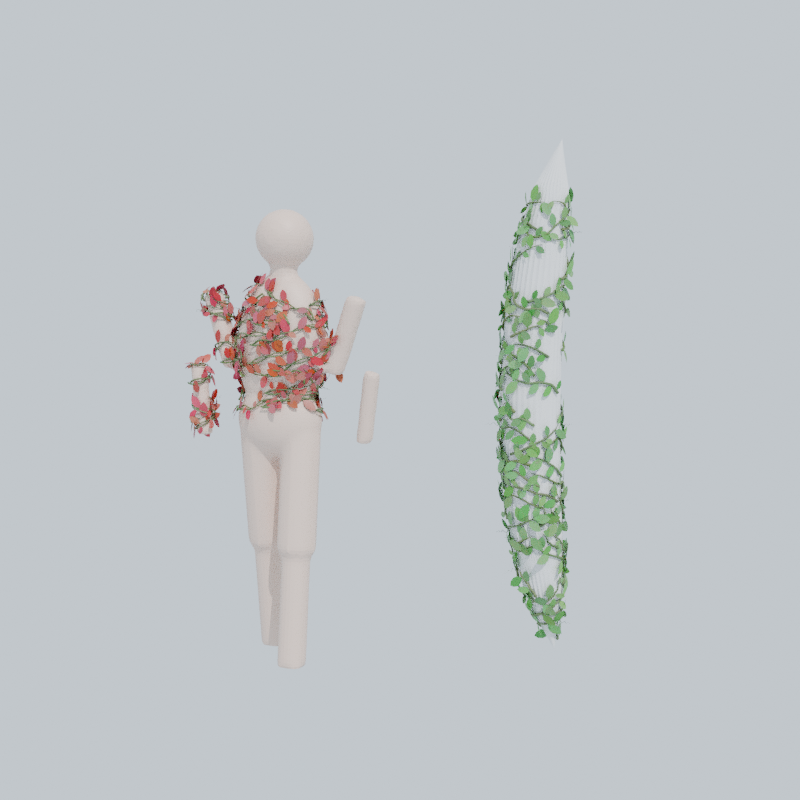
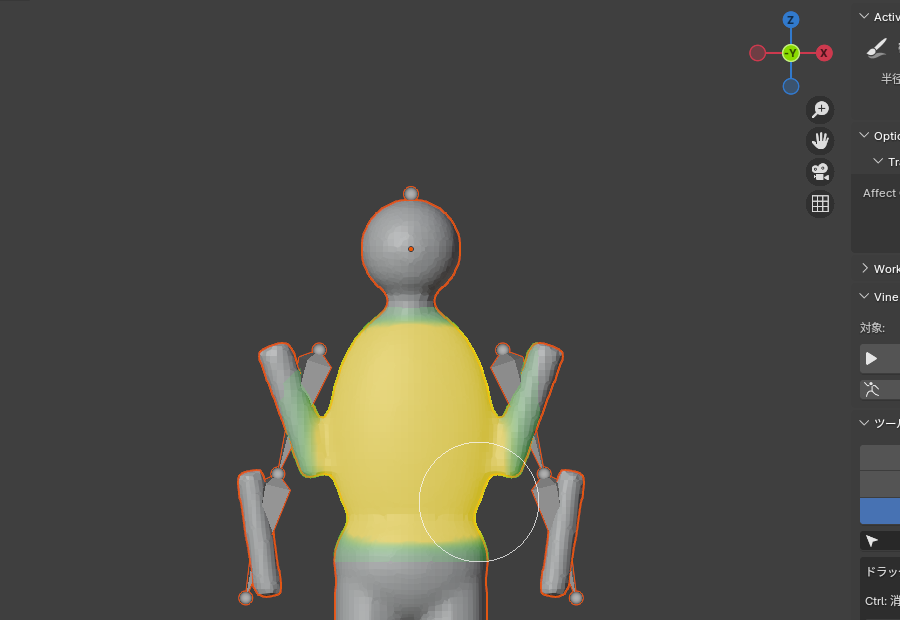
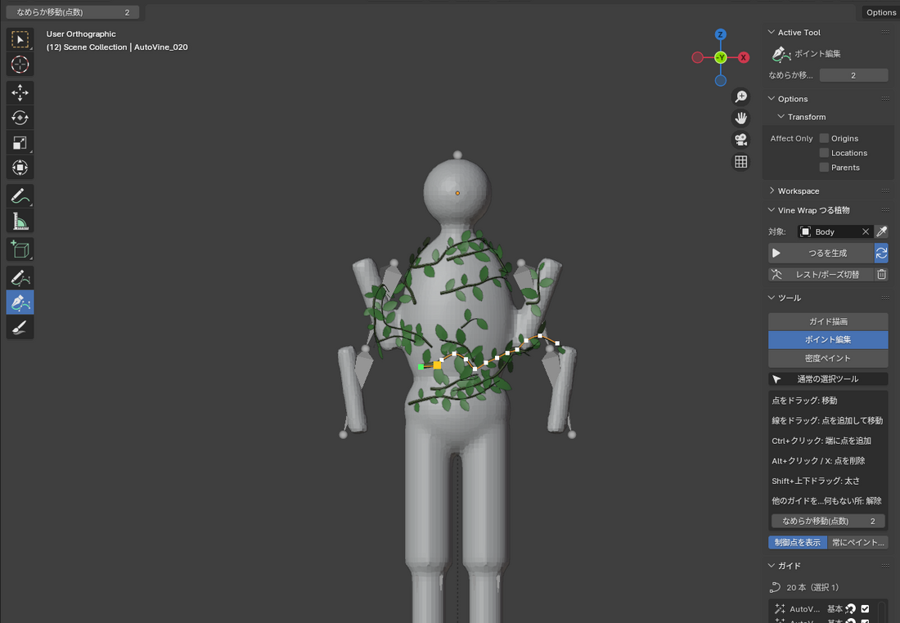
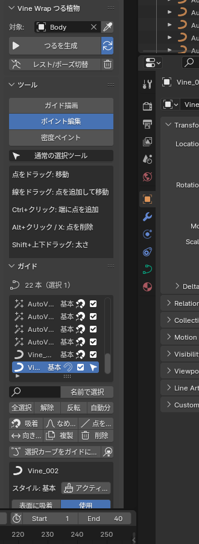

# Vine Wrap — つる植物を絡ませる Blender アドオン

オブジェクトに **ガイドカーブ** を描いたり、塗った範囲に自動生成したりして、つる植物を絡ませます。
ガイドは1本ずつ名前の付いたカーブで、編集モードに入らずに点の追加・移動・削除ができます。
対象がアーマチュアなどでアニメーションしていても、つるが追従します。



| 密度ペイント | ポイント編集（白=制御点, 緑=根元） | サイドバー |
|---|---|---|
|  |  |  |

## 対応バージョン
- Blender 3.6 〜 4.x（4.0 で実際の画面を操作して、4.2 LTS ではスクリプトから動作確認済み）

## インストール
1. `vine_wrap.zip` を使う（`vine_wrap/` フォルダを zip にしても可）
2. `編集 > プリファレンス > アドオン` からインストールして有効化（4.2 以降は `エクステンション` 右上の ▼ → `ディスクからインストール`）
3. 3Dビューポートで `N` → **Vine Wrap** タブ。ツールバー（左端）に3つのツールが追加されます

## 使い方
1. つるを絡ませたいメッシュを選び、スポイトボタンで **対象** に設定
2. ガイドを作る（どちらか、または両方）
   - **手で描く**: 「ガイド描画」ツールでドラッグ
   - **自動生成**: 「密度ペイント」ツールで生やしたい所を塗り、**ペイント範囲に生成**
3. 「ポイント編集」ツールでガイドを整える
4. つるは自動で作り直されます（「自動更新」オフなら **つるを生成** を押す）

## ツール（すべてオブジェクトモードのまま使える）
| ツール | 操作 |
|---|---|
| **ガイド描画** | ドラッグで新しいガイドを描く。対象の上から描き始めると **表面に吸着**、外から描き始めると **空間に浮かぶ** ガイドになる。`Shift`+ドラッグで選択中のガイドを延長 |
| **ポイント編集** | 点をドラッグ: 移動（前後の点もなめらかに付いてくる。点数は「なめらか移動」で設定）<br>線をドラッグ: そこに点を追加して移動<br>`Ctrl`+クリック: 端に点を追加（近い方の端）<br>`Alt`+クリック / `X` / `Delete`: 点を削除<br>`Shift`+上下ドラッグ: その点の太さ<br>他のガイドをクリック: そのガイドを選択 / 何もない所をクリック: 選択解除<br>`右クリック` / `Esc`: ドラッグを取り消し |
| **密度ペイント** | つるを生やしたい所を塗る。`Ctrl`: 消す、`Shift`: ぼかす、`[` `]`: 半径。塗った所はビューポートに緑〜黄色で表示される |

- 吸着ガイドは、点を動かしても表面に沿ったままです
- 選択中のガイドには、制御点（白）と根元（緑）が表示されます。ポイント編集ツールではカーソルの下の点が黄色になります
- 対象にアーマチュアがある場合、ツールを使うと自動でレストポーズになります（ガイドはレストポーズを基準にしているため）。**レスト/ポーズ切替** でアニメーション表示に戻せます（ポーズ中はガイドを隠します）

## ガイド
ガイドは1本ずつ `Vine_001`, `AutoVine_001` … という名前のカーブオブジェクトです（`<対象名>_VineGuides` コレクション）。
- **ガイド一覧**: クリックでそのガイドを選択。名前はダブルクリックで変更。一覧の下の ▸ から名前で絞り込みと並べ替えができる
- **名前で選択**: 入力した文字を含むガイドをまとめて選択
- 全選択 / 解除 / 反転 / 自動生成分だけ選択
- 選択したガイドに: **吸着**（表面に戻す）、**なめらか**、**点を均等**（「点の間隔」で打ち直す）、**向き反転**（根元と先端を入れ替える）、**複製**、**削除**
- **選択カーブをガイドにする**: 自分で作った普通のカーブもガイドとして使える
- ガイドごとの設定: 表面に吸着 / 使用 / 太さ倍率 / 葉の量倍率 / スタイル
- 普通のカーブなので、Blender の編集モードやモディファイアでも編集できます（変更すると自動で作り直されます）

## スタイル（見た目）
太さ・先細り・絡むつるの本数・うねり・巻きひげ・葉・色をまとめたプリセットです。
- ＋ でスタイルを追加（アクティブなスタイルを複製）
- 新しく描いたり自動生成したりするガイドには、**アクティブなスタイル** が使われます
- **選択ガイドに割り当て** / **使用中を選択** でガイドとスタイルを結び付けます
- スタイルの値を変えると、そのスタイルのつるが作り直されます

## ペイントから自動生成
| 項目 | 内容 |
|---|---|
| ペイント | 生成範囲・密度を表す頂点グループ（既定 `VineDensity`）。Blender のウェイトペイントで塗ってもよい。「全体」で全体を塗る、「消去」で消す |
| 密度(本/㎡) / 最大本数 | ウェイト1の面積1㎡あたりの本数（塗ったウェイトの濃さに比例） |
| しきい値 | これより薄い所にはつるが伸びない |
| 長さ / ばらつき / つる間隔 | つるの長さと、つる同士の最小距離 |
| 巻き付く軸 / 巻き付き / 登る・垂れる | どの軸の周りに巻き付くか（ワールドZ、または対象のローカルX/Y/Z）、巻き付きの強さ、軸方向へ登るか垂れるか |
| 既存のガイドを避ける | 手描きのガイドなど、すでにあるガイドとは重ならないように伸びる |
| 前回の自動生成を置き換え | 再生成のとき、前回の `AutoVine_*` を消して作り直す（手描きは残る） |
| 成長の詳細 | 直進性、うねり、分岐、制御点の間隔（大きいほど点が少なく編集しやすい）、シード |

生成されたガイドは普通のガイドと同じく自由に編集できます。

## アニメーション追従（設定パネル）
- **アーマチュア**: 対象のボーンウェイトをつるに写し、同じアーマチュアで変形します（対象にアーマチュアが無い場合は、シェイプキーがあればサーフェス変形、なければ親子付けだけになります）
- **サーフェス変形**: シェイプキーや Alembic で動く対象向け
- つるメッシュ（`<対象名>_Vines`）は、クリックで選ばれないようになっています。ガイドや対象を選びやすくするためです

## ファイル構成
```
vine_wrap/
  tools.py       ツール（描画・ポイント編集・密度ペイント）とツールバー登録
  overlay.py     ビューポート表示（制御点・ペイント・ブラシ円・描画中の線）
  guides.py      ガイドカーブの作成・読み書き・なめらかなハンドル
  growth.py      ペイント範囲での自動成長
  build.py       ガイド → つるの中心線（絡み・うねり・巻きひげ）
  meshgen.py     チューブ・葉のメッシュ
  binding.py     アーマチュア/サーフェス変形、マテリアル
  pipeline.py    生成処理と自動更新
  sampler.py     表面の検索、法線・ウェイトの補間
  operators.py / ui.py / properties.py
```
